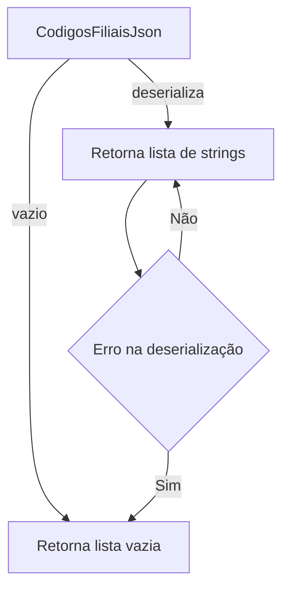
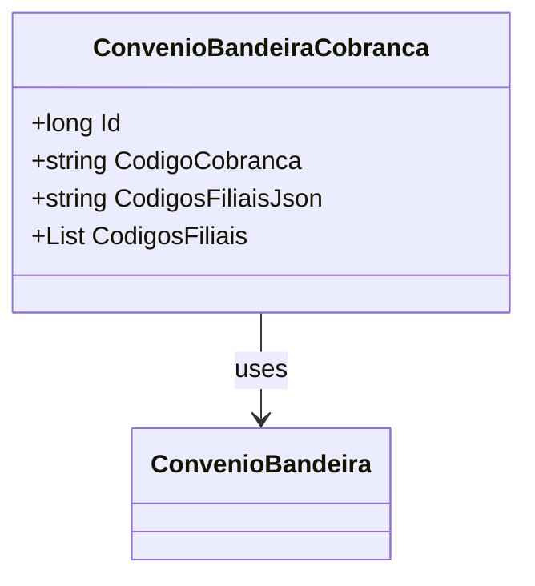

# ConvenioBandeiraCobranca
**Namespace**: IsthmusWinthor.Dominio.Entidades  
**Nome do Arquivo**: ConvenioBandeiraCobranca.cs

## Visão Geral e Responsabilidade
A classe `ConvenioBandeiraCobranca` representa a associação entre um convênio e suas bandeiras de cobrança, gerenciando a lógica relacionada aos códigos de cobrança utilizados em filiais. O problema de negócio que essa classe resolve envolve a necessidade de manter e manipular eficientemente os códigos de cobrança em formato JSON, permitindo que as informações das filiais sejam gerenciadas de forma flexível e segura.

## Métodos de Negócio

### Título: CodigosFiliais (get/set)
#### Objetivo
Garante que o usuário possa acessar e modificar uma lista de códigos de filiais, que é armazenada em formato JSON, com a devida serialização e deserialização.

#### Comportamento
1. O getter tenta deserializar a propriedade `CodigosFiliaisJson` para uma lista de strings.
2. Se `CodigosFiliaisJson` estiver vazia ou nula, retorna uma nova lista vazia.
3. Em caso de falha na deserialização, captura a exceção e retorna uma lista vazia.
4. O setter pega a lista de strings fornecida, serializa-a em JSON e atualiza a propriedade `CodigosFiliaisJson`.

#### Retorno
O getter retorna uma lista de strings que representa os códigos das filiais, enquanto o setter atualiza a representação JSON na propriedade `CodigosFiliaisJson`.

## Propriedades Calculadas e de Validação
- **CodigosFiliais**: é uma propriedade calculada que permite o acesso à lista de códigos de filiais de forma estruturada e valida a representação JSON.
  - Regra: A conversão entre a lista de strings e a representação JSON é feita na leitura e escrita, garantindo integridade dos dados.

## Navigations Property
- **ConvenioBandeira**: `[ConvenioBandeira](ConvenioBandeira.md)`

## Tipos Auxiliares e Dependências
- Enum: Nenhum utilizado.
- Classes estáticas/Helpers: Nenhum utilizado diretamente além do `System.Text.Json`.

## Diagrama de Relacionamentos

