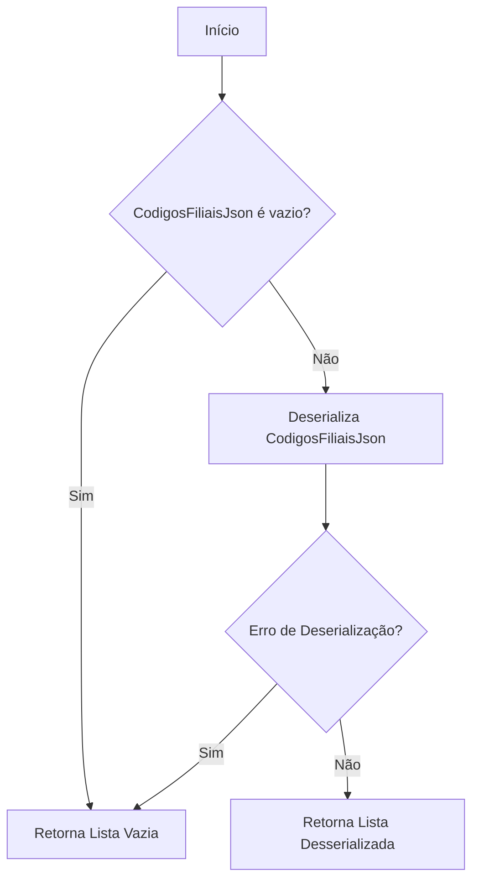
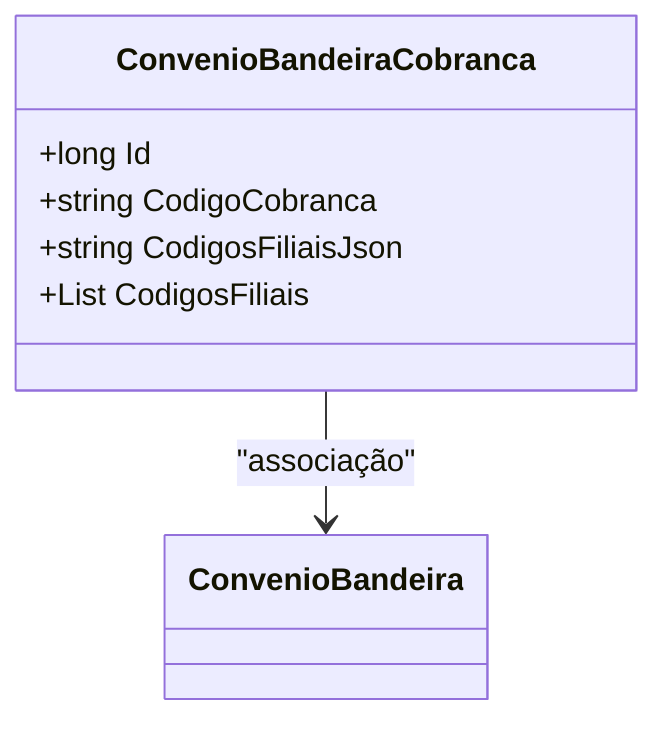

# ConvenioBandeiraCobranca
**Namespace**: IsthmusWinthor.Dominio.Entidades  
**Nome do Arquivo**: ConvenioBandeiraCobranca.cs  

## Visão Geral e Responsabilidade
A classe `ConvenioBandeiraCobranca` atua como um modelo de domínio que encapsula informações sobre um convênio de bandeira de cobrança. Ela resolve o problema de associar um código de cobrança a um convênio específico, permitindo gerenciar quais filiais estão relacionadas a esse código por meio de uma representação serializada em JSON. Isso simplifica a manipulação de dados e promove uma melhor organização da informação, especialmente em cenários onde a flexibilidade na definição de filiais é necessária.

## Métodos de Negócio

### Título: CodigosFiliais (Propriedade calculada)
**Objetivo**: Garante a conversão entre uma lista de códigos de filiais e sua representação em JSON, permitindo uma fácil leitura e escrita dos dados.  
**Comportamento**: 
1. No `get`, a propriedade tenta desserializar `CodigosFiliaisJson` em uma lista de strings.
2. Se `CodigosFiliaisJson` estiver vazio, retorna uma nova lista vazia.
3. Se ocorrer qualquer exceção durante a desserialização, retorna uma nova lista vazia.
4. No `set`, converte a lista de códigos de filiais recebida em um JSON e o armazena em `CodigosFiliaisJson`.
**Retorno**: Retorna a lista de códigos de filiais ou uma lista vazia em caso de falha.

## Propriedades Calculadas e de Validação
- **CodigosFiliais**: Esta propriedade executa a validação e a lógica para converter `CodigosFiliaisJson` em uma lista de strings e vice-versa. A regra é que a lista deve ser gerida como uma string JSON, permitindo armazenar múltiplos códigos de forma compacta.

## Navigations Property
- **ConvenioBandeira**: [ConvenioBandeira](ConvenioBandeira.md)

## Tipos Auxiliares e Dependências
- Nenhum enumerador ou classe auxiliar específica é utilizado na implementação de `ConvenioBandeiraCobranca`.

## Diagrama de Relacionamentos

---
Gerada em 29/12/2025 20:24:32
