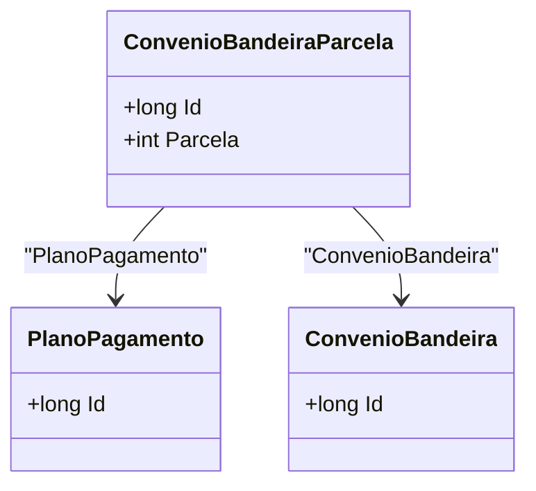

# ConvenioBandeiraParcela
**Namespace**: IsthmusWinthor.Dominio.Entidades  
**Nome do Arquivo**: ConvenioBandeiraParcela.cs  

## Visão Geral e Responsabilidade
A classe `ConvenioBandeiraParcela` representa uma entidade que conecta um plano de pagamento a um convênio de bandeira, estabelecendo uma relação entre as parcelas de um pagamento específico e uma bandeira de convênio. Isso permite gerenciar o comportamento financeiro em diferentes cenários de pagamento, garantindo que as condições do convênio sejam respeitadas para cada parcela.

## Métodos de Negócio
Não existem métodos de lógica complexos implementados nesta classe. Ela se limita a encapsular dados.

## Propriedades Calculadas e de Validação
Não há propriedades com lógica no `get` ou validação no `set`.

## Navigations Property
- `PlanoPagamento`: [PlanoPagamento](PlanoPagamento.md)
- `ConvenioBandeira`: [ConvenioBandeira](ConvenioBandeira.md)

## Tipos Auxiliares e Dependências
- `PlanoPagamento`: [PlanoPagamento](PlanoPagamento.md)
- `ConvenioBandeira`: [ConvenioBandeira](ConvenioBandeira.md)

## Diagrama de Relacionamentos

---
Gerada em 29/12/2025 20:24:39
