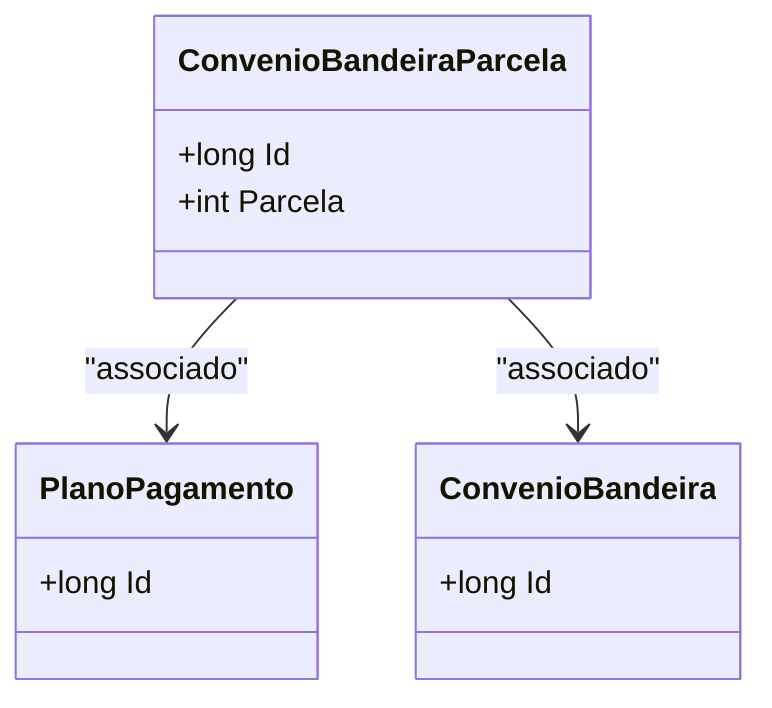

# ConvenioBandeiraParcela
**Namespace**: IsthmusWinthor.Dominio.Entidades  
**Nome do Arquivo**: ConvenioBandeiraParcela.cs  

## Visão Geral e Responsabilidade
A classe `ConvenioBandeiraParcela` representa a ligação entre um convênio (ConvenioBandeira) e as suas parcelas de pagamento (PlanoPagamento). Ela resolve o problema de controle da relação de um convênio específico com seus planos de pagamento, garantindo que os dados de parcelamento estejam adequadamente organizados e associados ao convênio correto, essencial para a gestão dos pagamentos da entidade.

## Métodos de Negócio
*Nota: Essa classe não possui métodos com lógica de negócio complexa, todos os métodos são autoexplicativos ou relacionados apenas a operações simples com as propriedades de acesso.*

## Propriedades Calculadas e de Validação
- **Id**: Identificador único da entidade.
- **Parcela**: Representa a identificação da parcela dentro do plano de pagamento.
- **PlanoPagamento**: Refere-se ao plano de pagamento associado, indicando se o convênio possui um plano específico configurado.
- **PlanoPagamentoId**: Identificador do plano de pagamento.
- **ConvenioBandeira**: Representa a bandeira do convênio associado, permitindo a categorização correta dos convênios.
- **ConvenioBandeiraId**: Identificador da bandeira do convênio.

## Properties 
Não foram identificadas regras de validações específicas nas propriedades.

## Navigation Properties
- **[PlanoPagamento](PlanoPagamento.md)**: Classe complexa que representa os diferentes planos de pagamento disponíveis.
- **[ConvenioBandeira](ConvenioBandeira.md)**: Classe complexa que define os convênios disponíveis e suas características.

## Tipos Auxiliares e Dependências
- **[PlanosPagamentoEnum](PlanosPagamentoEnum.md)**: Enum que pode ser utilizado para definir tipos de planos de pagamento.
- **[ConvenioBandeiraEnum](ConvenioBandeiraEnum.md)**: Enum que pode ser utilizado para definir tipos de bandeiras de convênio.

## Diagrama de Relacionamentos

