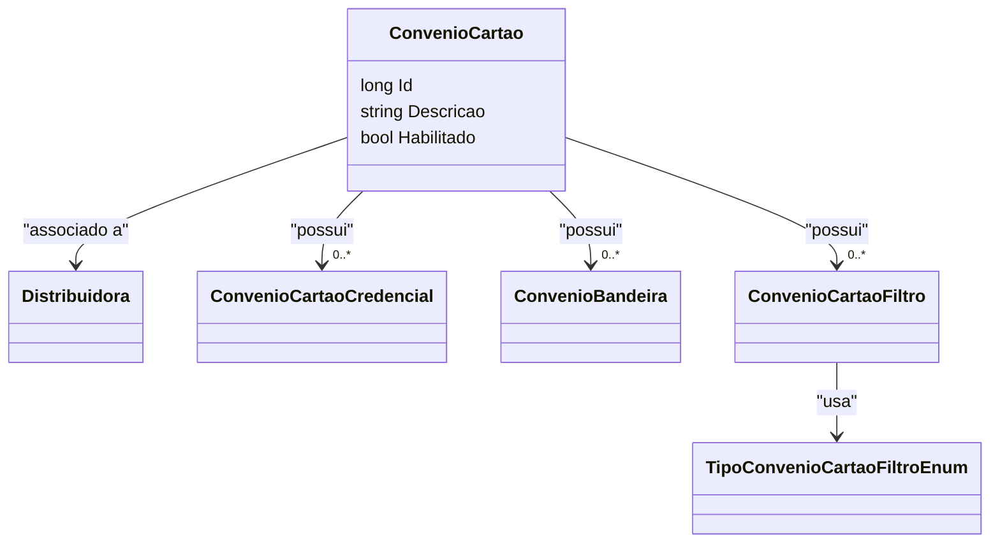

# ConvenioCartao
**Namespace**: IsthmusWinthor.Dominio.Entidades  
**Nome do Arquivo**: ConvenioCartao.cs  

## Visão Geral e Responsabilidade
A classe `ConvenioCartao` representa um convênio associado a um cartão, permitindo a gestão de credenciais e restrições aplicáveis a esses convênios. Essa classe é fundamental para garantir que os cartões sejam utilizados de acordo com as regras estabelecidas, assegurando que apenas operações autorizadas sejam permitidas com base nos filtros de aplicativo. Ela resolve o problema de negócio relacionado ao controle de credenciais e acesso a convênios de pagamento.

## Métodos de Negócio

### 1. Credencial(FiltroConvenioCartao filtroConvenioCartao)
- **Objetivo**: Garante que seja retornada a credencial ativa apropriada baseada no filtro de convênio, caso exista.
- **Comportamento**: 
  1. Verifica se o filtro `filtroConvenioCartao` é nulo. Se for, assume-se que não há filtro.
  2. Se o filtro não for nulo, busca uma credencial ativa que corresponda ao código da filial presente no filtro.
  3. Retorna a primeira credencial que corresponder ao filtro. Se não encontrar, retorna a primeira credencial ativa sem restrições de filial.
- **Retorno**: Retorna uma instância de `ConvenioCartaoCredencial`, que representa a credencial apropriada, ou `null` se nenhuma credencial estiver disponível.

### 2. ConvenioOperadoraCartao(FiltroConvenioCartao filtroConvenioCartao)
- **Objetivo**: Obtém a operadora de cartão associada à credencial do convênio, usando o filtro.
- **Comportamento**: 
  1. Chama o método `Credencial` para obter a credencial correspondente ao filtro.
  2. Retorna a operadora de cartão da credencial obtida.
- **Retorno**: Retorna uma instância de `OperadoraCartao` associada à credencial, ou `null` se a credencial não for encontrada.

### 3. ConvenioDiasCaptura(FiltroConvenioCartao filtroConvenioCartao)
- **Objetivo**: Retorna o número de dias de captura associado à credencial de cartão, utilizando o filtro fornecido.
- **Comportamento**: 
  1. Invoca o método `Credencial` para recuperar a credencial ativa em função do filtro.
  2. Retorna o valor de `DiasCaptura` da credencial, sendo zero caso a credencial não seja encontrada.
- **Retorno**: Um inteiro representando os dias de captura, ou `0` se não houver credencial disponível.

### 4. SeAplicaFiltroConvenio(ClienteLogado cliente)
- **Objetivo**: Determina se o convênio se aplica ao cliente baseado nos filtros definidos.
- **Comportamento**: 
  1. Verifica se há filtros definidos. Se não houver, retorna `true`.
  2. Para cada filtro presente:
     - Identifica o tipo de filtro e executa a lógica de verificação.
     - No caso de um filtro de faixa de CEP, divide o valor do filtro em dois para obter os limites da faixa.
     - Verifica se o CEP do cliente encontra-se fora da faixa especificada.
  3. Retorna verdadeiro se todos os filtros forem aplicados corretamente, ou falso caso contrário.
- **Retorno**: Um booleano indicando se o convênio se aplica ao cliente.

```mermaid
flowchart TD
    A[SeAplicaFiltroConvenio(cliente)]
    A -->|Filtros nulos| B[true]
    A -->|Filtros existentes| C[Verifica todos os filtros]
    C --> D[Tipo: FaixaCepRestringir]
    D --> E{Cliente dentro da faixa?}
    E -->|Sim| F[false]
    E -->|Não| G[continue verificando]
    C -->|Todos filtros verificados| H[true]
```

## Propriedades Calculadas e de Validação
- Nenhuma propriedade com lógica de cálculo ou validação encontrada.

## Navigation Property
- [Distribuidora](Distribuidora.md)
- [ConvenioCartaoCredencial](ConvenioCartaoCredencial.md)
- [ConvenioBandeira](ConvenioBandeira.md)
- [ConvenioCartaoFiltro](ConvenioCartaoFiltro.md)

## Tipos Auxiliares e Dependências
- [TipoConvenioCartaoFiltroEnum](TipoConvenioCartaoFiltroEnum.md)

## Diagrama de Relacionamentos

