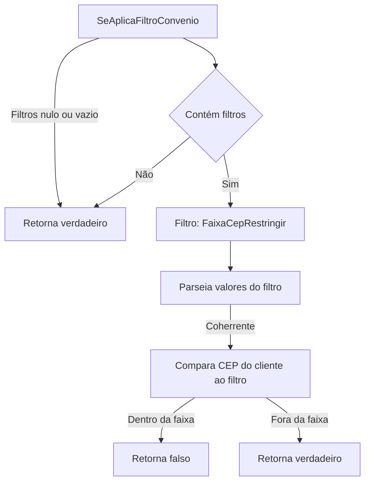
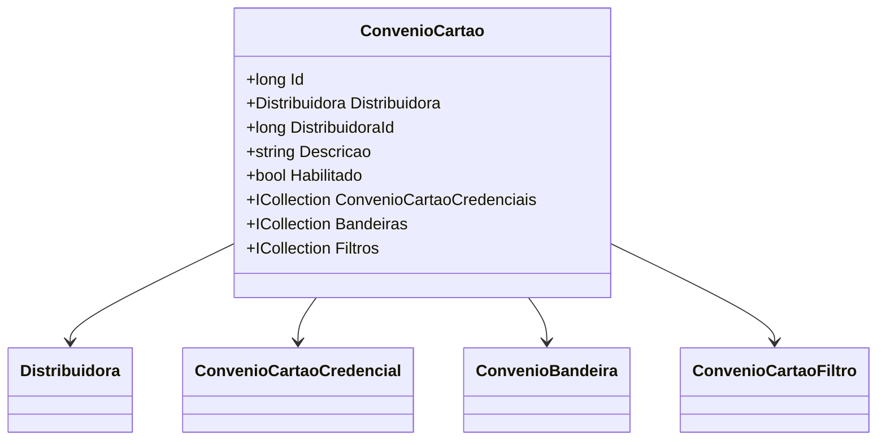

# ConvenioCartao

**Namespace**: IsthmusWinthor.Dominio.Entidades  
**Nome do Arquivo**: ConvenioCartao.cs  

## Visão Geral e Responsabilidade
A classe `ConvenioCartao` representa um convênio de cartão que é utilizado em transações financeiras, servindo como um ponto de controle das credenciais, bandeiras, e filtros associados a cartões em um sistema corporativo. Ela assegura a integridade das operações relacionadas a transações de cartão por meio de regras de negócio, que incluem a validação e a aplicação de filtros diversos dependendo do contexto do cliente. O problema de negócio que essa classe resolve é a gestão eficiente e segura das operações de cartões, permitindo que apenas convênios adequados sejam utilizados.

## Métodos de Negócio

### Credencial (public)
- **Objetivo**: Garante que a classe retorne a credencial apropriada para um convênio de cartão com base em um filtro fornecido.
- **Comportamento**: 
  1. Verifica se o filtro fornecido é nulo.
  2. Se o filtro não for nulo, procura nas credenciais ativas a primeira credencial que corresponda ao código da filial fornecido no filtro.
  3. Se não encontrar uma credencial que corresponda, retorna a primeira credencial ativa que não está vinculada a nenhuma filial.
- **Retorno**: Retorna um objeto `ConvenioCartaoCredencial` que é a credencial correspondente ao filtro ou nula se nenhuma for encontrada.

### ConvenioOperadoraCartao (public)
- **Objetivo**: Retorna a operadora de cartão associada ao convênio baseado no filtro fornecido.
- **Comportamento**: 
  1. Chama o método `Credencial` passando o filtro.
  2. Retorna a operadora de cartão da credencial encontrada.
- **Retorno**: Retorna um objeto `OperadoraCartao` ou nulo se nenhuma credencial adequada for encontrada.

### ConvenioDiasCaptura (public)
- **Objetivo**: Fornece a quantidade de dias para captura definida pela credencial associada ao convênio para o filtro fornecido.
- **Comportamento**: 
  1. Chama o método `Credencial`.
  2. Retorna o número de dias de captura da credencial encontrada ou zero se não houver credencial adequada.
- **Retorno**: Um inteiro que representa os dias para captura.

### SeAplicaFiltroConvenio (public)
- **Objetivo**: Avalia se os filtros associados ao convênio se aplicam a um cliente logado específico.
- **Comportamento**: 
  1. Verifica se há filtros estabelecidos e se estão ativos.
  2. Para cada filtro, verifica se o tipo de filtro é `FaixaCepRestringir`.
  3. Com base no tipo de filtro, parseia os valores para determinar se o CEP do cliente está fora da faixa permitida.
  4. Retorna verdadeiro se todos os filtros forem atendidos.
- **Retorno**: Um valor booleano indicando se os filtros se aplicam ao cliente.

## Propriedades Calculadas e de Validação
- **Credencial**: O método `Credencial` utilizou a lógica de verificação das credenciais ativas, assegurando a seleção correta baseada em um filtro. Não é uma propriedade, mas a lógica de validação do método é crucial para garantir a integridade dos dados transportados nas transações.

## Navigations Property
- [Distribuidora](Distribuidora.md)
- [ConvenioCartaoCredencial](ConvenioCartaoCredencial.md)
- [ConvenioBandeira](ConvenioBandeira.md)
- [ConvenioCartaoFiltro](ConvenioCartaoFiltro.md)

## Tipos Auxiliares e Dependências
- [TipoConvenioCartaoFiltroEnum](TipoConvenioCartaoFiltroEnum.md)
- [ClienteLogado](ClienteLogado.md)
- [OperadoraCartao](OperadoraCartao.md)

## Diagrama de Relacionamentos

---
Gerada em 29/12/2025 20:25:02
