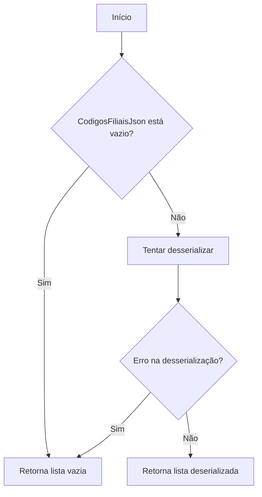
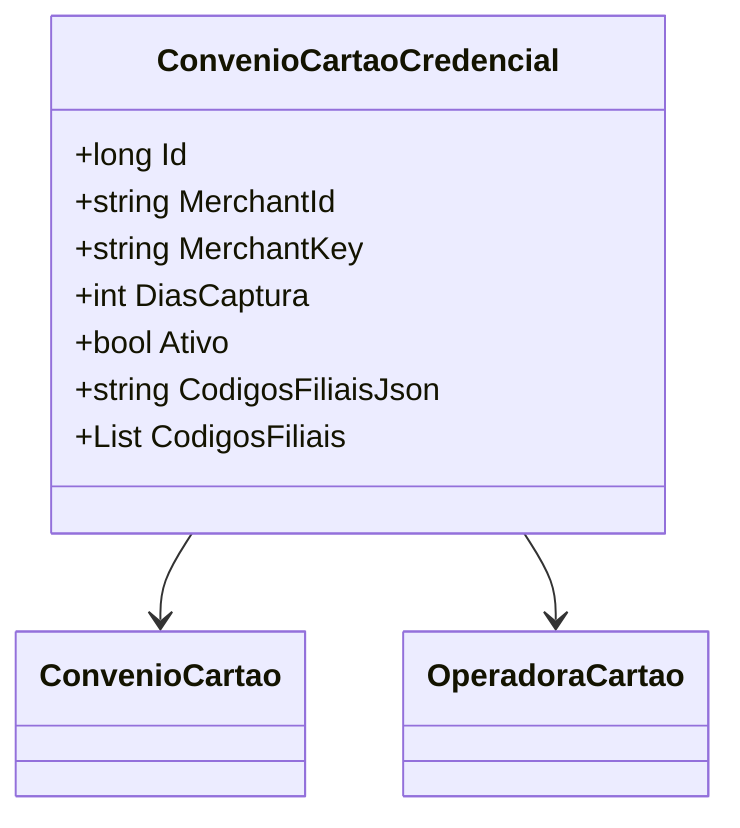

# ConvenioCartaoCredencial

- **Namespace**: IsthmusWinthor.Dominio.Entidades
- **Nome do Arquivo**: ConvenioCartaoCredencial.cs

## Visão Geral e Responsabilidade
A classe `ConvenioCartaoCredencial` representa a entidade que gerencia as credenciais associadas a um convênio de cartão de crédito. Ela atua como um ponto central para armazenar e manipular informações críticas sobre a operação de pagamento, incluindo dados do convênio e da operadora do cartão. Isso permite a integração adequada de diferentes operadoras de cartões com o sistema, assegurando que as transações sejam capturadas e processadas corretamente.

## Métodos de Negócio

### 1. Método: `CodigosFiliais` (Propriedade)
- **Objetivo**: Garante que a manipulação dos códigos das filiais seja realizada de forma segura e prática, convertendo uma string JSON em uma lista de strings.
- **Comportamento**:
  - O getter tenta desserializar a string `CodigosFiliaisJson` em uma `List<string>`. Se não houver dados ou ocorrer um erro, retorna uma lista vazia.
  - O setter serializa uma lista de códigos de filiais fornecida em formato JSON, garantindo que os dados estejam sempre no formato adequado.
- **Retorno**: O getter retorna uma lista de códigos de filiais como strings, enquanto o setter não retorna valores.

## Propriedades Calculadas e de Validação
- **CodigosFiliais**: Esta propriedade tem lógica na sua manipulação. Ela garante que, ao acessar os códigos de filiais, o sistema forneça uma lista vazia em caso de erro ou ausência de dados, evitando falhas durante a operação.

## Navigation Property
- [ConvenioCartao](ConvenioCartao.md)
- [OperadoraCartao](OperadoraCartao.md)

## Tipos Auxiliares e Dependências
Nenhum enumerador ou classe auxiliar está presente nesta classe.

## Diagrama de Relacionamentos

