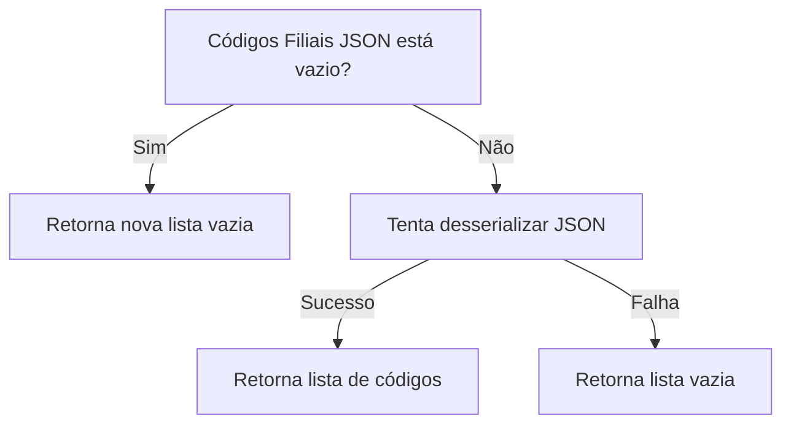
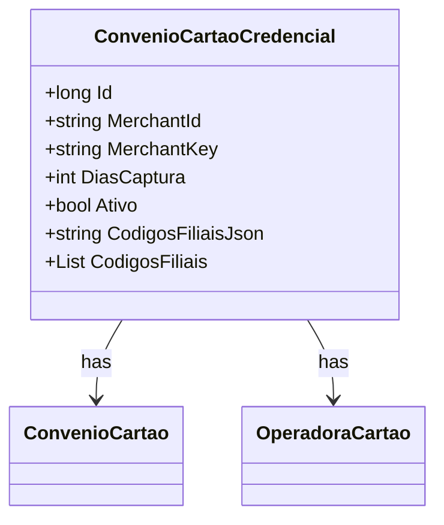

# ConvenioCartaoCredencial
**Namespace**: IsthmusWinthor.Dominio.Entidades  
**Nome do Arquivo**: ConvenioCartaoCredencial.cs

## Visão Geral e Responsabilidade
A classe `ConvenioCartaoCredencial` representa as credenciais de um convênio de cartão de crédito e está encarregada de gerenciar as informações relacionadas a convênios e operadoras de cartões. Ela garante que podem ser armazenadas e recuperadas informações relevantes como o identificador do comerciante, a chave do comerciante, e os códigos das filiais de forma segura e eficiente. A classe resolve o problema de integrar diferentes convênios e suas respectivas operadoras, permitindo uma operação ágil em sistemas financeiros.

## Métodos de Negócio

### Título: CodigosFiliais (get/set) - Visibilidade: Público
- **Objetivo**: Garante a conversão correta entre um formato JSON armazenado e uma lista de códigos de filiais, garantindo a integridade dos dados ao realizar a serialização e deserialização.
- **Comportamento**:
  1. **Get**: Verifica se `CodigosFiliaisJson` está vazio ou nulo.
     - Se sim, retorna uma nova lista vazia.
     - Se não, tenta desserializar o JSON em uma lista de strings. Se ocorrer uma exceção, retorna uma lista vazia.
  2. **Set**: Recebe uma lista de strings e a serializa em uma string JSON.
     - Se a lista for nula, inicializa como uma lista vazia.
     - Armazena a string JSON resultante em `CodigosFiliaisJson`.

- **Retorno**: O método `get` retorna uma lista de códigos de filiais, enquanto o `set` armazena essa lista em formato JSON no campo correspondente.

## Propriedades Calculadas e de Validação
- `CodigosFiliais`: Esta propriedade possui lógica no `get` e no `set`. O `get` deserializa um JSON armazenado, enquanto o `set` o serializa, garantindo que os dados sempre sejam convertidos corretamente entre os dois formatos.

## Navigation Property
- `ConvenioCartao` - [ConvenioCartao](ConvenioCartao.md)
- `OperadoraCartao` - [OperadoraCartao](OperadoraCartao.md)

## Tipos Auxiliares e Dependências
- `IEntidade` - [IEntidade](IEntidade.md)

## Diagrama de Relacionamentos

---
Gerada em 29/12/2025 20:25:17
