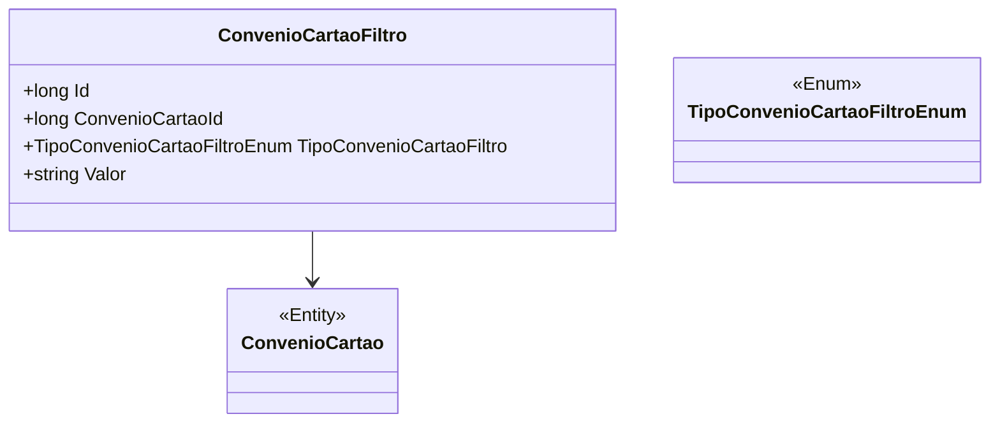

# ConvenioCartaoFiltro

**Namespace**: IsthmusWinthor.Dominio.Entidades  
**Nome do Arquivo**: ConvenioCartaoFiltro.cs  

## Visão Geral e Responsabilidade
A classe `ConvenioCartaoFiltro` representa um filtro de cartões de convênio dentro do sistema, facilitando a restrição e busca de informações relacionadas a convênios específicos. Este modelo é crucial para a integração de serviços que necessitam realizar operações filtradas com base em diferentes tipos de convênios e seus respectivos valores, garantindo que apenas os dados pertinentes sejam utilizados em processos de negócios.

## Métodos de Negócio
**Nota:** Esta classe não contém métodos com lógica complexa, apenas getters e setters simples.

## Propriedades Calculadas e de Validação
- **Valor**: Esta propriedade é armazenada como uma string, porém deve ser validada durante a inserção no sistema conforme o tipo de convênio. Dependendo do `TipoConvenioCartaoFiltro`, pode haver regras específicas de formatação ou conteúdo para o valor associado a este filtro.

## Navigation Properties
- [ConvenioCartao](ConvenioCartao.md): Representa a associação com a classe `ConvenioCartao`, que contém detalhes do convênio ao qual o filtro se aplica.

## Tipos Auxiliares e Dependências
- [TipoConvenioCartaoFiltroEnum](TipoConvenioCartaoFiltroEnum.md): Este enumerador determina os tipos válidos de filtros para convênios de cartões.

## Diagrama de Relacionamentos

---
Gerada em 29/12/2025 20:25:25
