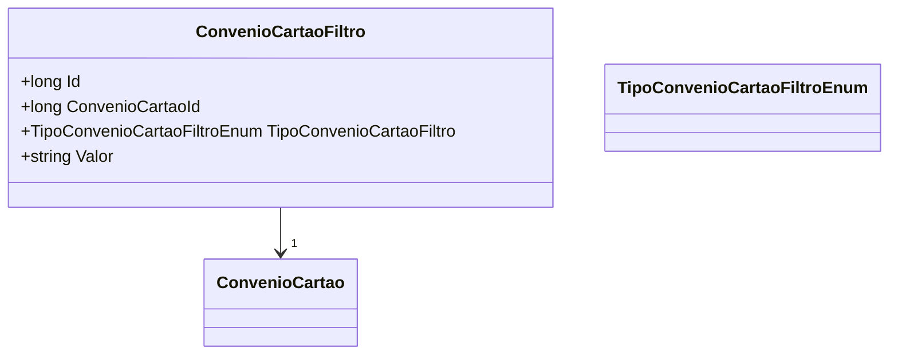

# ConvenioCartaoFiltro
**Namespace**: IsthmusWinthor.Dominio.Entidades  
**Nome do Arquivo**: ConvenioCartaoFiltro.cs  

## Visão Geral e Responsabilidade
A classe `ConvenioCartaoFiltro` representa um filtro que é utilizado para selecionar convenções de cartões em um sistema de gerenciamento de convenções. Ela encapsula a relação entre um convênio de cartão específico e seus critérios de filtragem. O problema de negócio que essa classe resolve é a necessidade de aplicar diferentes condições (filtros) na busca e seleção de convênios de cartões com base em critérios específicos, facilitando a extração de informações relevantes para o usuário.

## Propriedades Calculadas e de Validação
- **Id**: Identificador único para cada filtro de convênio de cartão.
- **ConvenioCartao**: Referência à classe `ConvenioCartao`, representando a convenção de cartão associada ao filtro.
- **ConvenioCartaoId**: Identificador da convenção de cartão. Deve ser validado para garantir que corresponde a um `ConvenioCartao` existente.
- **TipoConvenioCartaoFiltro**: Enumeração que define o tipo de filtro aplicado, assegurando que apenas tipos válidos de filtros possam ser utilizados.
- **Valor**: Representa o valor de filtragem, deve ser validado de acordo com o tipo de filtro para garantir a integridade dos dados.

## Navigations Property
- `[ConvenioCartao](ConvenioCartao.md)`: Esta propriedade está associada à classe `ConvenioCartao`, representando a convenção de cartão que o filtro refere-se.

## Tipos Auxiliares e Dependências
- `[TipoConvenioCartaoFiltroEnum](TipoConvenioCartaoFiltroEnum.md)`: Enum que define os diferentes tipos de filtros que podem ser aplicados aos convênios de cartões.

## Diagrama de Relacionamentos

