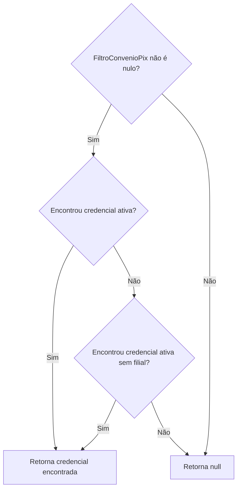
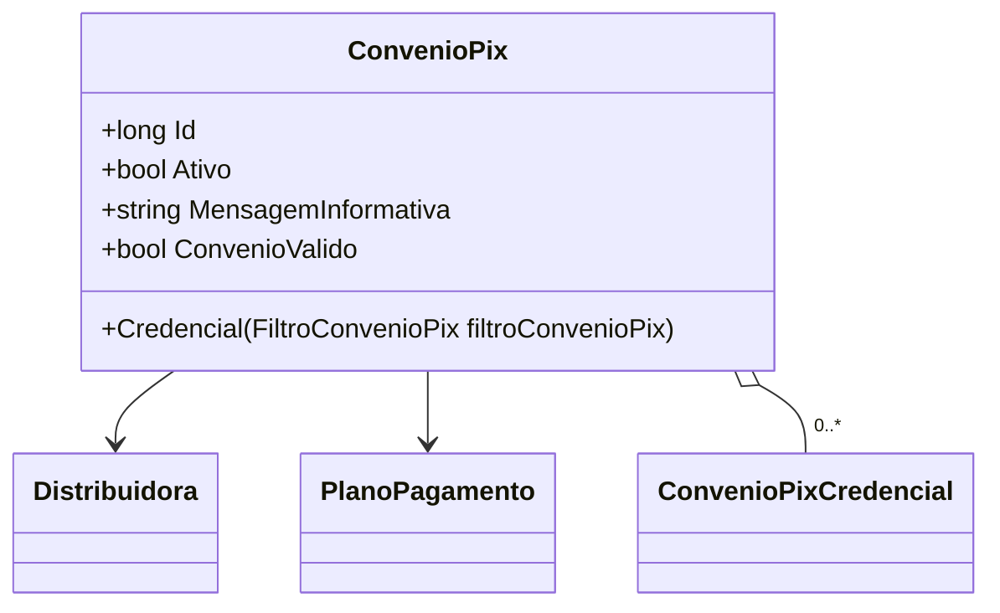

# ConvenioPix
**Namespace**: IsthmusWinthor.Dominio.Entidades  
**Nome do Arquivo**: ConvenioPix.cs  

## Visão Geral e Responsabilidade
A classe `ConvenioPix` representa um convênio relacionado ao sistema de pagamentos via PIX. Seu papel é gerenciar as credenciais associadas a um `Distribuidora` e um `PlanoPagamento`, além de controlar a validade do convênio para operações. A classe garante que somente convênios ativos e que possuem um plano de pagamento associado podem ser considerados válidos, o que é crucial para a integridade das transações financeiras.

## Métodos de Negócio

### Credencial(FiltroConvenioPix filtroConvenioPix)
- **Objetivo**: Este método assegura que as credenciais associadas ao convênio sejam recuperadas com base em critérios específicos, como o filial. Ele garante que apenas credenciais ativas sejam consideradas, promovendo a integridade dos dados utilizados nas operações.
- **Comportamento**: 
  1. Verifica se `filtroConvenioPix` não é nulo.
  2. Tenta encontrar a primeira `ConvenioPixCredencial` que esteja ativa e cujo `CodigosFiliais` contenha o código da filial do filtro.
  3. Se não encontrar, busca por outra `ConvenioPixCredencial` que esteja ativa e que não tenha códigos de filial associados.
  4. Retorna a credencial encontrada ou `null` se nenhuma credencial válida existir.
- **Retorno**: Retorna uma instância de `ConvenioPixCredencial` que atende às condições especificadas ou `null` se não houver credenciais ativas.

## Propriedades Calculadas e de Validação

### ConvenioValido
- **Validação**: Esta propriedade determina se o convênio é válido.
- **Regra**: Para que o convênio seja considerado válido, ele deve estar ativo (`Ativo == true`), ter um `PlanoPagamentoId` válido (maior que zero) e ter pelo menos uma `ConvenioPixCredencial` ativa.

## Navigations Property
- `Distribuidora`: [Distribuidora](Distribuidora.md)
- `PlanoPagamento`: [PlanoPagamento](PlanoPagamento.md)
- `ConvenioPixCredenciais`: [ConvenioPixCredencial](ConvenioPixCredencial.md)

## Tipos Auxiliares e Dependências
- `FiltroConvenioPix`: [FiltroConvenioPix](FiltroConvenioPix.md)
- `ConvenioPixCredencial`: [ConvenioPixCredencial](ConvenioPixCredencial.md)

## Diagrama de Relacionamentos

