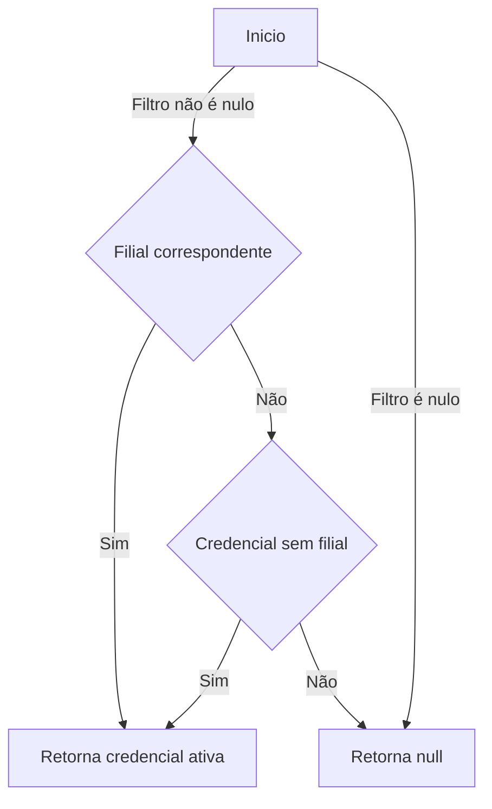
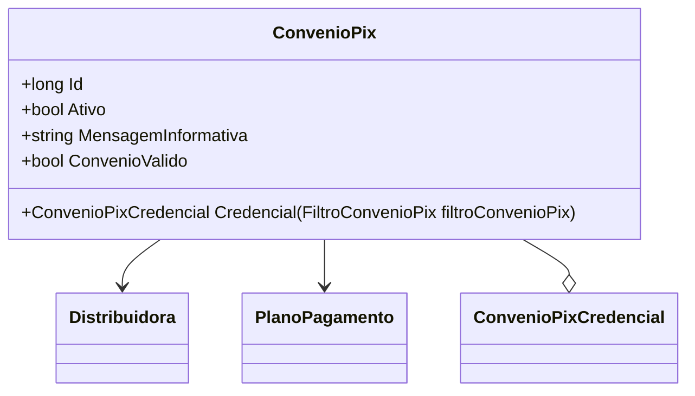

# ConvenioPix
**Namespace**: IsthmusWinthor.Dominio.Entidades  
**Nome do Arquivo**: ConvenioPix.cs  

## Visão Geral e Responsabilidade
A classe `ConvenioPix` representa a configuração de um convênio de pagamento via PIX para distribuidoras. Ela gerencia as credenciais necessárias para a autenticação e a validação da operação, além de influenciar na exibição de informações relativas ao convênio. A principal responsabilidade desta classe é garantir que o convênio esteja ativo e que as credenciais necessárias estejam disponíveis e válidas, promovendo a integridade e segurança nas transações financeiras.

## Métodos de Negócio

### Título: `Credencial(FiltroConvenioPix filtroConvenioPix)` - Visibilidade: `public`
**Objetivo**: Este método garante que, ao buscar uma credencial para o convênio, sejam considerados apenas aqueles que estão ativos e que podem ser associados à filial correta, assegurando a segurança na operação.  
**Comportamento**: 
1. Verifica se o parâmetro `filtroConvenioPix` não é nulo.
2. Tenta buscar as credenciais ativas que correspondem ao código da filial fornecido.
3. Se não encontrar nenhuma credencial correspondente, busca por uma credencial ativa sem restrições de filiais.
4. Retorna a credencial encontrada ou nula caso não exista nenhuma válida.
**Retorno**: Retorna um objeto do tipo `ConvenioPixCredencial` se uma credencial válida for encontrada, ou `null` caso contrário.

## Propriedades Calculadas e de Validação

### `ConvenioValido`
- **Lógica**: Esta propriedade computa se o convênio é considerado válido, verificando se ele está ativo, se possui um ID de plano de pagamento definido e se existe pelo menos uma credencial ativa. Esta validação é fundamental para garantir que são feitas operações apenas com convênios devidamente configurados.

## Navigation Property
- `Distribuidora`: [Distribuidora](Distribuidora.md)
- `PlanoPagamento`: [PlanoPagamento](PlanoPagamento.md)
- `ConvenioPixCredenciais`: Coleção de credenciais registradas sob este convênio. Cada credencial é representada pela classe [ConvenioPixCredencial](ConvenioPixCredencial.md).

## Tipos Auxiliares e Dependências
- [FiltroConvenioPix](FiltroConvenioPix.md)
- [ConvenioPixCredencial](ConvenioPixCredencial.md)
- [PlanoPagamento](PlanoPagamento.md)

## Diagrama de Relacionamentos

---
Gerada em 29/12/2025 20:25:38
