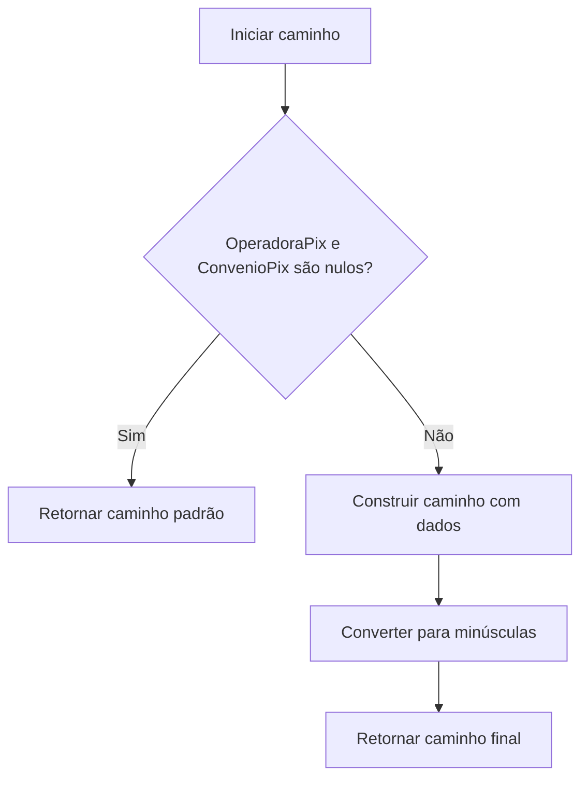

# ConvenioPixCredencial
**Namespace**: IsthmusWinthor.Dominio.Entidades  
**Nome do Arquivo**: ConvenioPixCredencial.cs  

## Visão Geral e Responsabilidade
A classe `ConvenioPixCredencial` representa as credenciais necessárias para a integração de um sistema de pagamentos via Pix com diferentes operadores e conveniências. A principal responsabilidade é gerenciar as informações associadas às chaves Pix e garantir que as transações sejam realizadas de forma segura e estruturada. Ela aborda diretamente necessidades de negócio relacionadas ao recebimento de pagamentos, associando informações como o recebedor, a operadora e a validade das chaves Pix, assim contribuindo para a automação e eficiência nos processos de pagamento.

## Métodos de Negócio

### Título: CaminhoCertificado() - Público
**Objetivo**: Garante que o caminho do certificado digital seja gerado corretamente para transações feitas via Pix dinâmico, considerando a operadora e a distribuidora.  
**Comportamento**:
1. Inicia a construção de um caminho do certificado na estrutura "pix/{Operadora}/{DistribuidoraId}/producao/{Id}-{Identificador}.pfx".
2. Utiliza o operador `?.` para garantir que a `OperadoraPix` e a `ConvenioPix` não sejam nulas antes de acessá-las, evitando exceções.
3. Converte todo o caminho para letras minúsculas.
4. Retorna a string resultante que representa o caminho completo do certificado.
**Retorno**: Retorna uma string que representa o caminho para o arquivo do certificado digital associado à chave Pix.

## Propriedades Calculadas e de Validação

### CodigosFiliais
- A propriedade `CodigosFiliais` possui lógica na sua manipulação. No getter, ela tenta desserializar a string `CodigosFiliaisJson` em uma lista de strings. Caso a string esteja vazia ou haja uma exceção, retornará uma nova lista vazia.
- No setter, ela serializa a lista recebida de volta em formato JSON para armazenar na propriedade `CodigosFiliaisJson`.

## Navigations Property
- [ConvenioPix](ConvenioPix.md): Representa a conveniência associada a esta credencial Pix.
- [OperadoraPix](OperadoraPix.md): Representa a operadora de Pix utilizada.
- [ContaPixEstatico](ContaPixEstatico.md): Contas Pix estáticas associadas.
- [ContaPix](ContaPix.md): Contas Pix dinâmicas associadas.

## Tipos Auxiliares e Dependências
- [OperadoraPix](OperadoraPix.md)
- [ContaPixEstatico](ContaPixEstatico.md)
- [ContaPix](ContaPix.md)

## Diagrama de Relacionamentos

---
Gerada em 29/12/2025 20:25:56
