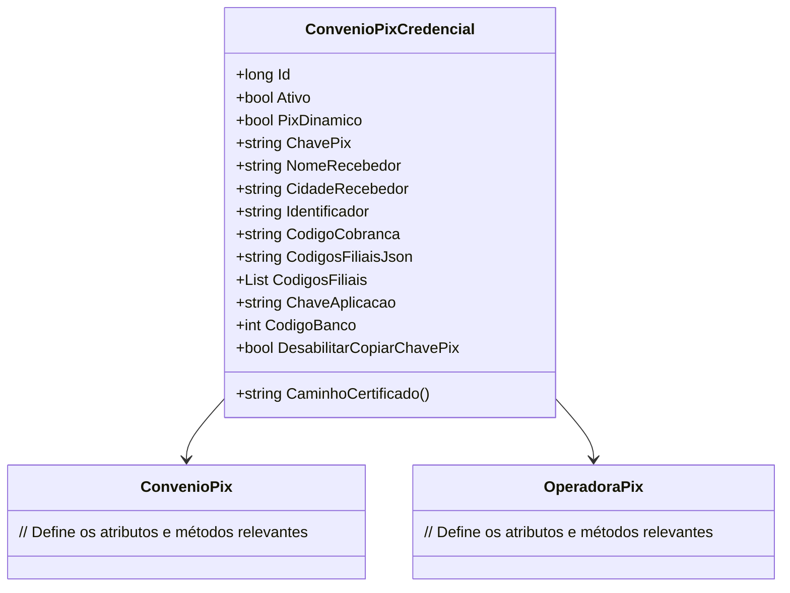

# ConvenioPixCredencial
**Namespace**: IsthmusWinthor.Dominio.Entidades  
**Nome do Arquivo**: ConvenioPixCredencial.cs  

## Visão Geral e Responsabilidade
A classe `ConvenioPixCredencial` representa uma entidade responsável pela gestão das credenciais de um convênio relacionado ao sistema de pagamentos via Pix. Ela aborda as necessidades de um cenário de negócios onde é imprescindível manter um registro das credenciais, chaves e informações relacionadas ao recebimento de pagamentos. A classe permite a configuração de detalhes que garantem a integridade e a funcionalidade operacional das transações via Pix, incluindo validações relacionadas à ativação do convênio e gerenciamento das credenciais associadas.

## Métodos de Negócio

### Título: `CaminhoCertificado` - `public`
- **Objetivo**: Este método constrói e retorna o caminho para o certificado digital associado ao convênio Pix, utilizando informações como a operadora de Pix, o identificador do convênio e o ID da credencial.
- **Comportamento**: 
    1. O método inicia a geração da string de caminho com o prefixo `"pix/"`.
    2. Complementa com a operadora do Pix se disponível.
    3. Adiciona o identificador da distribuidora vinculada ao convênio.
    4. Conclui o caminho com o formato `"{id}-{identificador}.pfx"` e transforma tudo para letras minúsculas, garantindo consistência no armazenamento.
- **Retorno**: Retorna uma string representando o caminho para o certificado digital.

## Propriedades Calculadas e de Validação

### Propriedade: `CodigosFiliais`
- **Regra**: Esta propriedade realiza a conversão entre uma lista de códigos de filiais e seu formato JSON armazenado na propriedade `CodigosFiliaisJson`. 
    - **Get**: Deserializa o JSON para uma lista de strings, retornando uma lista vazia caso haja erro.
    - **Set**: Serializa a lista de strings recebida para o formato JSON para armazenamento.

## Navigations Property
- [`ConvenioPix`](ConvenioPix.md): Classe responsável pela associação do convênio ao qual as credenciais pertencem.
- [`OperadoraPix`](OperadoraPix.md): Classe que define as operadoras de pagamento disponíveis.

## Tipos Auxiliares e Dependências
- [`OperadoraPix`](OperadoraPix.md): Representa as operadoras de pagamento utilizadas na transação.
- `System.Text.Json`: Utilizada para serialização e deserialização de JSON.

## Diagrama de Relacionamentos

