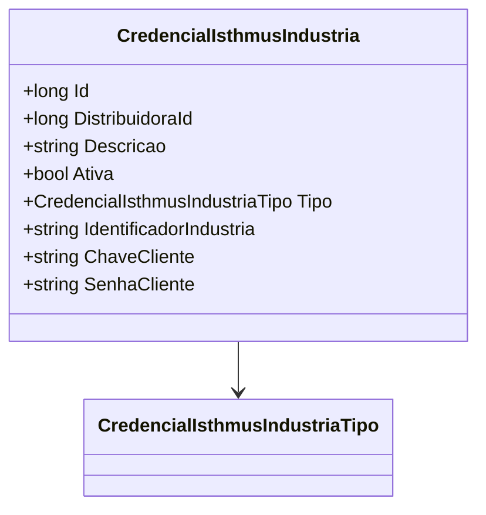

# CredencialIsthmusIndustria
- **Namespace**: IsthmusWinthor.Dominio.Entidades  
- **Nome do Arquivo**: CredencialIsthmusIndustria.cs  

## Visão Geral e Responsabilidade
A classe `CredencialIsthmusIndustria` representa as credenciais de acesso de uma indústria associada a uma distribuidora no contexto do sistema. Seu papel é garantir a integridade e a segurança dos dados de autenticação e autorização para as interações entre a indústria e a plataforma, abordando o problema de como gerenciar e armazenar de forma segura as credenciais necessárias para acessos variados dentro do sistema.

## Métodos de Negócio
- **Título**: (Não existem métodos com lógica na classe)
  
## Propriedades Calculadas e de Validação
- Nenhuma propriedade na classe possui lógica no `get` ou validação no `set`.

## Navigations Property
- Não há propriedades que representam classes complexas do domínio na classe `CredencialIsthmusIndustria`.

## Tipos Auxiliares e Dependências
- **Enumeradores Utilizados**:
  - `[CredencialIsthmusIndustriaTipo](CredencialIsthmusIndustriaTipo.md)`

## Diagrama de Relacionamentos

Esta documentação fornece uma visão clara e organizada sobre a classe `CredencialIsthmusIndustria`, destacando suas responsabilidades e os elementos que a compõem, promovendo entendimento e manutenção adequados.
