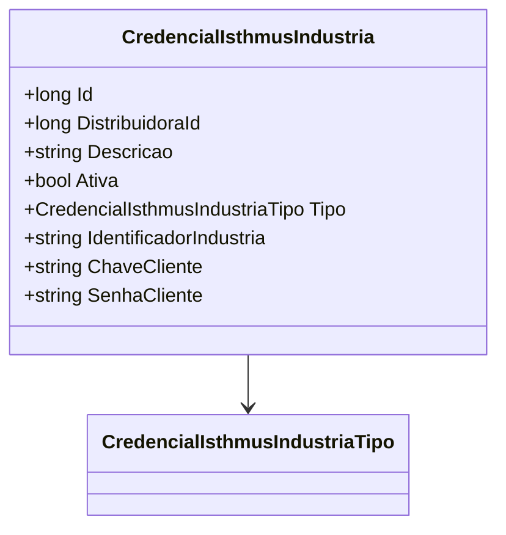

# CredencialIsthmusIndustria
- **Namespace**: IsthmusWinthor.Dominio.Entidades
- **Nome do Arquivo**: CredencialIsthmusIndustria.cs

## Visão Geral e Responsabilidade
A classe `CredencialIsthmusIndustria` representa uma entidade que armazena informações sensíveis relacionadas a credenciais de acesso de indústrias a um sistema específico. Ela é responsável por gerenciar dados como identificador da indústria, chave e senha do cliente, além de definir se as credenciais estão ativas. Isto é crítico para a segurança e integridade do sistema ao permitir o acesso à distribuição de produtos ou serviços.

## Métodos de Negócio
*Não há métodos com lógica complexa implementadas nesta classe, apenas propriedades simples de armazenamento.*

## Propriedades Calculadas e de Validação
*Não existem propriedades com lógica de cálculo ou validação presentes dentro dos getters ou setters nesta classe.*

## Navigations Property
- `CredencialIsthmusIndustriaTipo`: [CredencialIsthmusIndustriaTipo](CredencialIsthmusIndustriaTipo.md)

## Tipos Auxiliares e Dependências
- `CredencialIsthmusIndustriaTipo`: [CredencialIsthmusIndustriaTipo](CredencialIsthmusIndustriaTipo.md)

## Diagrama de Relacionamentos

---
Gerada em 29/12/2025 20:26:06
