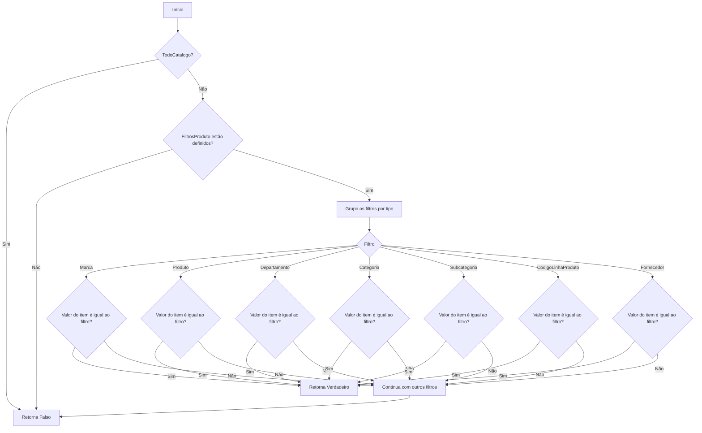
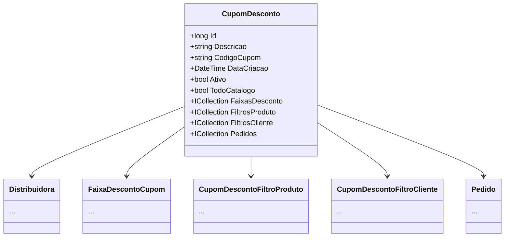

# CupomDesconto

**Namespace**: IsthmusWinthor.Dominio.Entidades  
**Nome do Arquivo**: CupomDesconto.cs  

## Visão Geral e Responsabilidade
A classe `CupomDesconto` representa um modelo de negócio que encapsula a lógica relacionada ao gerenciamento de cupons de desconto em um sistema de vendas. Sua responsabilidade principal é definir as regras de aplicação de um cupom a produtos no carrinho do cliente. Ela aborda o problema de negócios de forma a garantir que apenas os produtos que atendam a critérios específicos possam receber um desconto, permitindo uma gestão eficaz de promoções e estratégias de marketing.

## Métodos de Negócio

### SeAplica (public)
- **Objetivo**: Determinar se o cupom de desconto é aplicável a um item específico do carrinho.
- **Comportamento**: 
  1. Verifica se o cupom se aplica a todo o catálogo ou se não há filtros de produto definidos.
  2. Se o cupom não se aplica a todo o catálogo, agrupa os filtros de produto por tipo.
  3. Para cada grupo de filtros, verifica se pelo menos um dos filtros é satisfeito pelo item do carrinho.
     - Se o filtro for do tipo "Marca", valida o código da marca do item.
     - Se o filtro for do tipo "Produto", valida o código do produto do item.
     - E assim por diante para os outros tipos de filtros, incluindo Departamento, Categoria, Subcategoria, Código Linha Produto e Fornecedor.
  4. Retorna verdadeiro se todos os filtros forem atendidos ou se não houver filtros aplicáveis.

## Propriedades Calculadas e de Validação
- **DataFim**: A validade do cupom deve ser verificada com base na data atual e este campo. Se a data atual exceder `DataFim`, o cupom não deve ser aplicado.
  
## Navegação Property
- `[Distribuidora](Distribuidora.md)`: Representa a distribuidora que emite o cupom.
- `[FaixaDescontoCupom](FaixaDescontoCupom.md)`: Define as faixas de desconto que podem ser aplicadas.
- `[CupomDescontoFiltroProduto](CupomDescontoFiltroProduto.md)`: Define os filtros de produtos associados ao cupom.
- `[CupomDescontoFiltroCliente](CupomDescontoFiltroCliente.md)`: Define os filtros de clientes associados ao cupom.
- `[Pedido](Pedido.md)`: Representa os pedidos aos quais o cupom pode estar associado.

## Tipos Auxiliares e Dependências
- `[TipoAplicacaoCupomEnum](TipoAplicacaoCupomEnum.md)`: Enum que define como o cupom pode ser aplicado.
- `[FiltroPlataformaEnum](FiltroPlataformaEnum.md)`: Enum que define plataformas para os filtros do cupom.
- `[FiltroProdutoEnum](FiltroProdutoEnum.md)`: Enum que define os tipos de filtros aplicáveis.

## Diagrama de Relacionamentos

