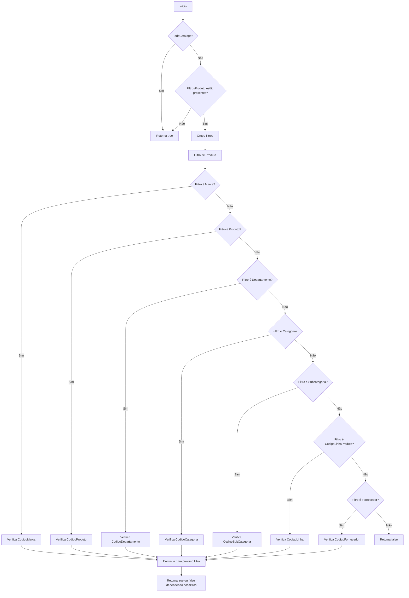
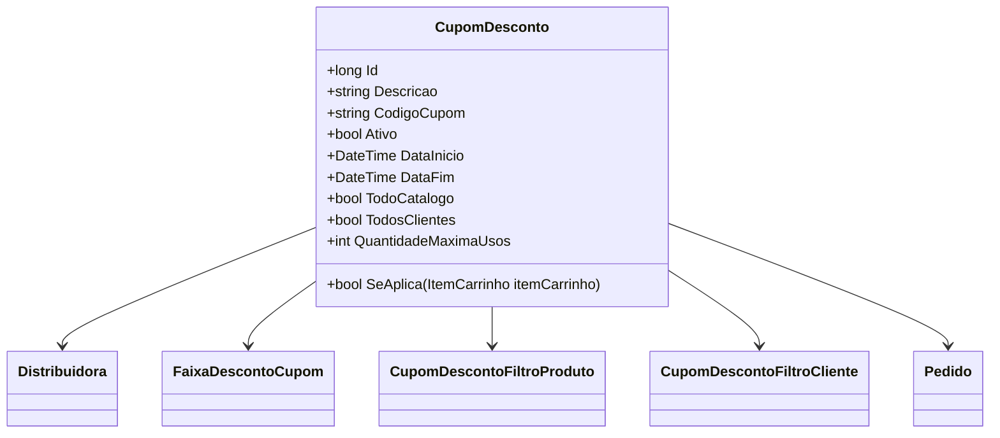

# CupomDesconto
**Namespace**: IsthmusWinthor.Dominio.Entidades  
**Nome do Arquivo**: CupomDesconto.cs  

## Visão Geral e Responsabilidade
A classe `CupomDesconto` representa um cupom promocional dentro do sistema, sendo responsável por validar quais itens do carrinho podem ser aplicáveis a um desconto específico. Esse modelo de domínio aborda a lógica de aplicação de cupons, permitindo uma gestão eficiente de promoções, que impacta diretamente nas vendas e no relacionamento com os clientes.

## Métodos de Negócio

### Título: SeAplica (public)
- **Objetivo**: Garantir que o cupom de desconto se aplica a um item do carrinho com base em suas propriedades e nas regras definidas nos filtros de produto.
- **Comportamento**: 
  1. Verifica se o cupom se aplica a todo o catálogo ou se não possui filtros de produtos.
  2. Agrupa os filtros de produtos associados ao cupom por tipo.
  3. Para cada grupo de filtros, verifica se existe pelo menos um filtro que corresponde aos atributos do item do carrinho (ex: marca, produto, departamento, etc.).
  4. Retorna `true` se todos os filtros forem atendidos ou se o cupom se aplica a todo o catálogo; caso contrário, retorna `false`.

## Propriedades Calculadas e de Validação
- Não há propriedades com lógica de cálculo ou validação.

## Navigations Property
- [Distribuidora](Distribuidora.md)
- [FaixaDescontoCupom](FaixaDescontoCupom.md)
- [CupomDescontoFiltroProduto](CupomDescontoFiltroProduto.md)
- [CupomDescontoFiltroCliente](CupomDescontoFiltroCliente.md)
- [Pedido](Pedido.md)

## Tipos Auxiliares e Dependências
- [TipoAplicacaoCupomEnum](TipoAplicacaoCupomEnum.md)
- [FiltroPlataformaEnum](FiltroPlataformaEnum.md)
- [FiltroProdutoEnum](FiltroProdutoEnum.md)
- [FormaAplicacaoDescontoEnum](FormaAplicacaoDescontoEnum.md)

## Diagrama de Relacionamentos

---
Gerada em 29/12/2025 20:26:24
