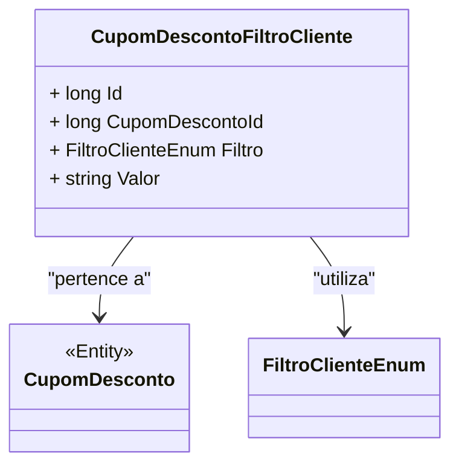

# CupomDescontoFiltroCliente
**Namespace**: IsthmusWinthor.Dominio.Entidades  
**Nome do Arquivo**: CupomDescontoFiltroCliente.cs  

## Visão Geral e Responsabilidade
A classe `CupomDescontoFiltroCliente` representa um filtro que determina quais clientes podem utilizar um determinado cupom de desconto. Esta classe é crucial para aplicação das regras de negócio que asseguram que descontos sejam aplicados apenas a clientes apropriados, ajudando a promover uma estratégia de marketing direcionada e evitar abusos por certos perfis de clientes.

## Métodos de Negócio
Atualmente, a classe não possui métodos de negócio complexos que impliquem na definição de regras. Portanto, não há descrição de métodos a incluir neste documento.

## Propriedades Calculadas e de Validação
A classe contém propriedades que são essenciais para o controle de acesso ao uso dos cupons, mas não tem lógica de cálculo ou validação particular em suas getters ou setters. 

## Navigations Property
A classe possui a seguinte propriedade complexa que se relaciona diretamente com o domínio:
- [CupomDesconto](CupomDesconto.md)

## Tipos Auxiliares e Dependências
A classe `CupomDescontoFiltroCliente` utiliza o seguinte enumerador:
- [FiltroClienteEnum](FiltroClienteEnum.md)

## Diagrama de Relacionamentos

---
Gerada em 29/12/2025 20:26:31
