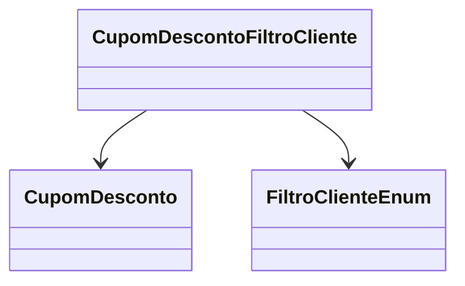

# CupomDescontoFiltroCliente
**Namespace**: IsthmusWinthor.Dominio.Entidades  
**Nome do Arquivo**: CupomDescontoFiltroCliente.cs  

## Visão Geral e Responsabilidade
A classe `CupomDescontoFiltroCliente` representa um filtro associado a um cupom de desconto específico, permitindo a restrição ou segmentação do uso do cupom com base em certas características de clientes. O objetivo de negócio é permitir que promoções sejam aplicadas apenas a grupos de clientes que atendem a critérios específicos, aumentando a relevância da oferta e o engajamento.

## Métodos de Negócio
*Nota: Esta classe não contém métodos de negócio complexos com lógica adicional. Portanto, esta seção não se aplica.*

## Propriedades Calculadas e de Validação
- **Valor**: Propriedade que deve ser validada para garantir que o valor atribuído cumpre com as regras de formato ou critério de apresentação definido pela lógica de negócio.

## Navigations Property
- `[CupomDesconto](CupomDesconto.md)`: Esta propriedade representa a relação com o cupom de desconto associado e é uma classe complexa que contém informações relativas ao desconto oferecido.

## Tipos Auxiliares e Dependências
- `[FiltroClienteEnum](FiltroClienteEnum.md)`: Enum utilizado para especificar diferentes filtros aplicáveis a clientes, definindo as regras específicas de qual cliente é aplicado o cupom.

## Diagrama de Relacionamentos

