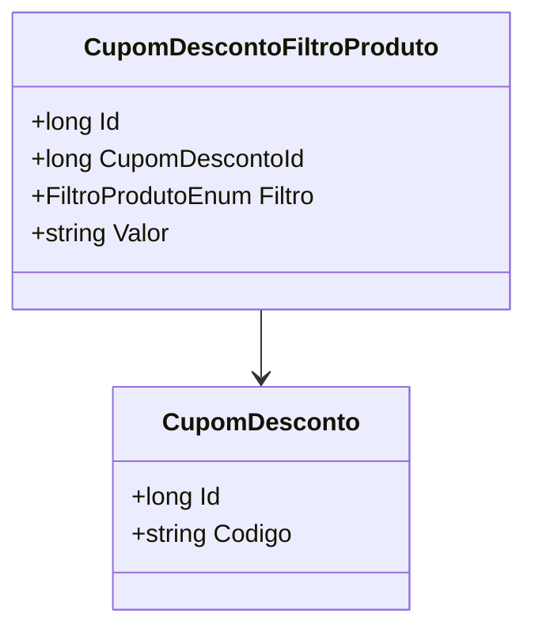

# CupomDescontoFiltroProduto
**Namespace**: IsthmusWinthor.Dominio.Entidades  
**Nome do Arquivo**: CupomDescontoFiltroProduto.cs  

## Visão Geral e Responsabilidade
A classe `CupomDescontoFiltroProduto` representa a relação entre um cupom de desconto e o filtro de produtos ao qual ele se aplica. Essa classe é responsável por armazenar informações detalhadas que determinam quais produtos podem ser comprados com um cupom específico, facilitando a promoção e gerenciamento de descontos no sistema. O objetivo é garantir que os códigos de desconto sejam aplicados apenas a produtos adequados, conforme definido por regras de negócio específicas.

## Propriedades Calculadas e de Validação
- **Filtro**: Esta propriedade armazena o tipo de filtro que é aplicado ao produto (ex: categoria, marca). O valor determina quais produtos estão incluídos na aplicação do desconto. A regra por trás do cálculo é assegurar que apenas produtos que correspondam ao filtro definido possam ser comprados com o cupom específico.

## Navigations Property
- [CupomDesconto](CupomDesconto.md): A classe `CupomDesconto` representa o cupom de desconto atribuído a este filtro.

## Tipos Auxiliares e Dependências
- [FiltroProdutoEnum](FiltroProdutoEnum.md): Enum que define os diferentes tipos de filtros que podem ser aplicados a produtos.

## Diagrama de Relacionamentos

A classe `CupomDescontoFiltroProduto` indica que um "Filtro de Produto" pode estar associado a um "Cupom de Desconto", formando parte de um sistema de gestão de promoções que assegura a integridade dos dados ao aplicar regras em relação aos produtos elegíveis para descontos.
