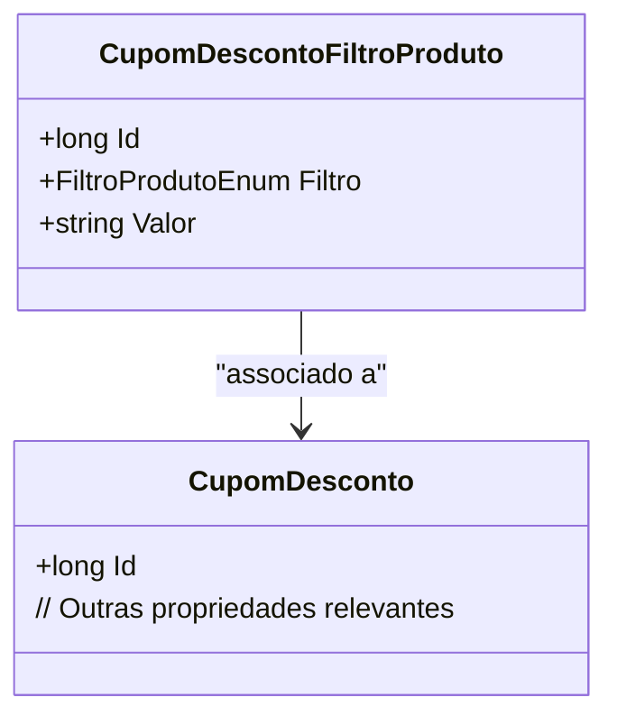

# CupomDescontoFiltroProduto
**Namespace**: IsthmusWinthor.Dominio.Entidades  
**Nome do Arquivo**: CupomDescontoFiltroProduto.cs  

### Visão Geral e Responsabilidade
A classe `CupomDescontoFiltroProduto` representa a entidade de filtragem de produtos associados a um cupom de desconto. Sua principal responsabilidade é determinar quais produtos são elegíveis para um desconto específico, conforme as regras de negócio definidas por meio do `FiltroProdutoEnum`. Isso permite que a aplicação gerencie descontos de forma granular, garantindo que apenas os produtos que atendem a certas condições sejam beneficiados, evitando assim a aplicação de descontos indevidos.

### Métodos de Negócio
Atualmente, a classe não possui métodos de negócio com lógica complexa, portanto, essa seção não se aplicará.

### Propriedades Calculadas e de Validação
- **Valor**: Esta propriedade deve validar se o valor atribuído está de acordo com o tipo de filtro especificado pela propriedade `Filtro`. Por exemplo, se o filtro é um tipo numérico, o valor deve ser um número. 
- **CupomDesconto**: Esta propriedade é uma navegação para a entidade `CupomDesconto`, representando a relaciona entre o cupom e seu filtro.

### Navigation Property
- [CupomDesconto](CupomDesconto.md)

### Tipos Auxiliares e Dependências
- [FiltroProdutoEnum](FiltroProdutoEnum.md)

### Diagrama de Relacionamentos

Esta documentação técnica fornece uma visão clara sobre a classe `CupomDescontoFiltroProduto`, destacando suas responsabilidades dentro da camada de domínio e como ela se integra a outras partes do sistema.
---
Gerada em 29/12/2025 20:26:40
