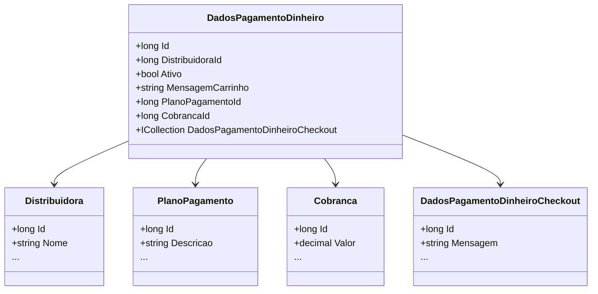

# DadosPagamentoDinheiro
**Namespace**: IsthmusWinthor.Dominio.Entidades  
**Nome do Arquivo**: DadosPagamentoDinheiro.cs  

## Visão Geral e Responsabilidade
A classe `DadosPagamentoDinheiro` representa os dados associados ao pagamento em dinheiro no sistema. Seu principal papel é consolidar e gerenciar as informações relacionadas às transações pagas em dinheiro, incluindo a ligação com outras entidades fundamentais, como `Distribuidora` e `PlanoPagamento`. Este modelo é crucial para garantir que os dados de pagamento sejam corretamente armazenados e recuperados, permitindo uma experiência de checkout eficiente e clara.

## Métodos de Negócio

### Título: Implicit Operator
**Objetivo**: Facilitar a conversão de um `DadosPagamentoDinheiroViewModel` para um `DadosPagamentoDinheiro`, assegurando que todos os dados necessários sejam corretamente atribuídos.

**Comportamento**:
1. Cria uma nova instância de `DadosPagamentoDinheiro`.
2. Atribui as propriedades da instância com os valores do `dadosPagamentoDinheiroViewModel`.
3. Para cada item na coleção `DadosPagamentoDinheiroCheckouts`, define a propriedade `DadosPagamentoDinheiroId` para que o checkout associado referencie corretamente o pagamento em dinheiro.
4. Retorna a nova instância de `DadosPagamentoDinheiro` com todos os dados mapeados.

**Retorno**: Retorna uma instância do tipo `DadosPagamentoDinheiro`, representando os dados de pagamento em dinheiro preenchidos.

## Propriedades Calculadas e de Validação

- **MensagemCheckout**: Esta propriedade é indicada como depreciada e foi movida para `DadosPagamentoDinheiroCheckout`, onde a lógica de filtragem é realizada por filial do pedido. Portanto, não deve ser utilizada.
  
## Navigations Property

- [Distribuidora](Distribuidora.md)
- [PlanoPagamento](PlanoPagamento.md)
- [Cobranca](Cobranca.md)
- [DadosPagamentoDinheiroCheckout](DadosPagamentoDinheiroCheckout.md)

## Tipos Auxiliares e Dependências

- `DadosPagamentoDinheiroViewModel` (classe que representa o modelo de visualização para dados de pagamento)
- `IEntidade` (interface padrão para entidades do domínio)
  
## Diagrama de Relacionamentos

---
Gerada em 29/12/2025 20:26:55
