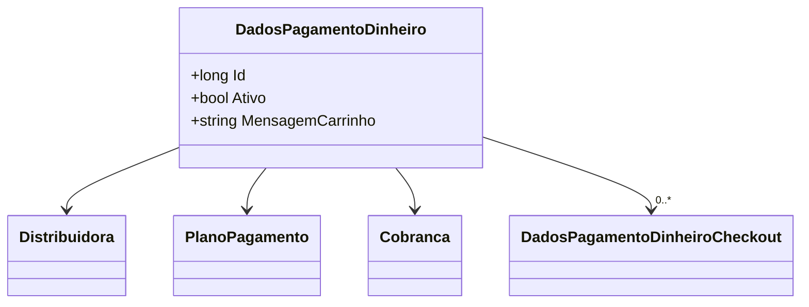

# DadosPagamentoDinheiro
**Namespace**: IsthmusWinthor.Dominio.Entidades  
**Nome do Arquivo**: DadosPagamentoDinheiro.cs  

## Visão Geral e Responsabilidade
A classe `DadosPagamentoDinheiro` é um componente crucial do domínio que representa os dados relacionados ao pagamento em dinheiro em um sistema de pagamentos. Ela encapsula informações sobre a distribuidora, plano de pagamento e cobrança, além de obter status como ativo e mensagens relevantes para o carrinho de compras. Esta classe é projetada para resolver os problemas de gerenciamento e validação de dados de pagamento, assegurando que informações essenciais sobre transações financeiras sejam tratadas de forma consistente e eficaz.

## Métodos de Negócio

### Título: `implicit operator DadosPagamentoDinheiro` (Visibilidade: Público)
- **Objetivo**: Realizar a conversão implícita de `DadosPagamentoDinheiroViewModel` para `DadosPagamentoDinheiro`, garantindo que as propriedades críticas do ViewModel sejam corretamente mapeadas para a entidade do domínio.
- **Comportamento**: 
  1. Inicializa uma nova instância de `DadosPagamentoDinheiro`.
  2. Mapeia o `Id` do ViewModel para `Id` da entidade.
  3. Mapeia `DistribuidoraId` do ViewModel para a propriedade correspondente na entidade.
  4. Verifica e atribui o valor de `Ativo`.
  5. Mapeia o `CobrancaId`, assegurando que o valor correto da cobrança é atribuído.
  6. Mapeia o `PlanoPagamentoId` correspondente.
  7. Atribui `MensagemCarrinho` do ViewModel para a propriedade na entidade.
  8. Para cada checkout no `DadosPagamentoDinheiroCheckouts`, mapeia e atribui `DadosPagamentoDinheiroId`, garantindo a associação correta entre os dados de pagamento e seus checkouts.
- **Retorno**: Retorna uma instância de `DadosPagamentoDinheiro` preenchida, representando os dados do pagamento em dinheiro a partir do ViewModel.

## Propriedades Calculadas e de Validação
- **Ativo**: Esta propriedade armazena o estado de atividade do pagamento. Uma lógica de validação assegura que somente pagamentos ativos possam ser processados.
- **MensagemCarrinho**: Possui a lógica de exibir uma mensagem pertinente ao estado do carrinho de compras, que pode influenciar a experiência do usuário.

## Navigation Property
- **Distribuidora**: `[Distribuidora](Distribuidora.md)`
- **PlanoPagamento**: `[PlanoPagamento](PlanoPagamento.md)`
- **Cobranca**: `[Cobranca](Cobranca.md)`
- **DadosPagamentoDinheiroCheckout**: `[DadosPagamentoDinheiroCheckout](DadosPagamentoDinheiroCheckout.md)`

## Tipos Auxiliares e Dependências
- **DadosPagamentoDinheiroViewModel**: `[DadosPagamentoDinheiroViewModel](DadosPagamentoDinheiroViewModel.md)`
- **Distribuidora**: `[Distribuidora](Distribuidora.md)`
- **PlanoPagamento**: `[PlanoPagamento](PlanoPagamento.md)`
- **Cobranca**: `[Cobranca](Cobranca.md)`
- **DadosPagamentoDinheiroCheckout**: `[DadosPagamentoDinheiroCheckout](DadosPagamentoDinheiroCheckout.md)`

## Diagrama de Relacionamentos

