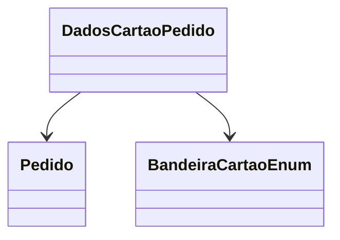

```markdown
# DadosCartaoPedido
**Namespace**: IsthmusWinthor.Dominio.Entidades  
**Nome do Arquivo**: DadosCartaoPedido.cs  

## Visão Geral e Responsabilidade
A classe `DadosCartaoPedido` representa os dados associados ao pagamento de um pedido utilizando cartão de crédito. Ela encapsula informações essenciais sobre o resumo do pagamento, tais como o número do cartão, quantidade de parcelas e a bandeira do cartão. Essa classe é fundamental para realizar a interação entre o sistema de pedidos e os dados de pagamento, assegurando que todas as informações necessárias para processar o pagamento sejam corretamente germinadas e manipuladas.

## Métodos de Negócio
*Esta classe não possui métodos com lógica complexa, portanto esta seção não se aplica.*

## Propriedades Calculadas e de Validação
- `QuantidadeParcelas`: Esta propriedade deve garantir que o número de parcelas esteja dentro de um intervalo válido definido pela lógica de negócio (ex: mínimo de 1 e máximo de 12 parcelas).
  
## Navigation Properties
- `Pedido`: Representa uma associação com a classe [Pedido](Pedido.md), onde contém informações sobre o pedido ao qual o pagamento está vinculado.

## Tipos Auxiliares e Dependências
- **Enumeradores**:
  - [BandeiraCartaoEnum](BandeiraCartaoEnum.md): Define as diferentes bandeiras de cartão que podem ser utilizadas no pagamento.

## Diagrama de Relacionamentos

```
---
Gerada em 29/12/2025 20:27:03
