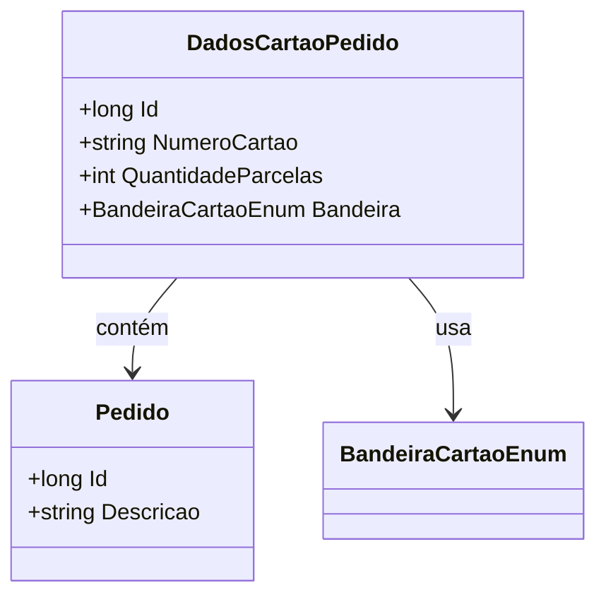

# DadosCartaoPedido
**Namespace**: IsthmusWinthor.Dominio.Entidades  
**Nome do Arquivo**: DadosCartaoPedido.cs  

## Visão Geral e Responsabilidade
A classe `DadosCartaoPedido` representa os detalhes do cartão de crédito utilizado em um pedido. Ela é responsável por manter a informação necessária para processar a transação financeira, incluindo o número do cartão, a quantidade de parcelas e a bandeira do cartão. Essa classe assegura que os dados do cartão estejam corretamente associados ao pedido ao qual pertencem.

## Métodos de Negócio
Atualmente, a classe `DadosCartaoPedido` não possui métodos com lógica complexa que implementem regras de negócio. Os métodos existentes são simples getters e setters para as propriedades da classe.

## Propriedades Calculadas e de Validação
- **NumeroCartao**: Esta propriedade deve ser validada para garantir que esteja em um formato corretamente configurado (por exemplo, número do cartão não pode ser vazio).
- **QuantidadeParcelas**: Deve ser validada para garantir que o número de parcelas seja um valor positivo. 

## Navigation Property
- **Pedido**: Link para a classe [Pedido](Pedido.md).
  
## Tipos Auxiliares e Dependências
- **Enumerador**: 
  - [BandeiraCartaoEnum](BandeiraCartaoEnum.md): Define as bandeiras de cartões disponíveis para processamento.

## Diagrama de Relacionamentos

