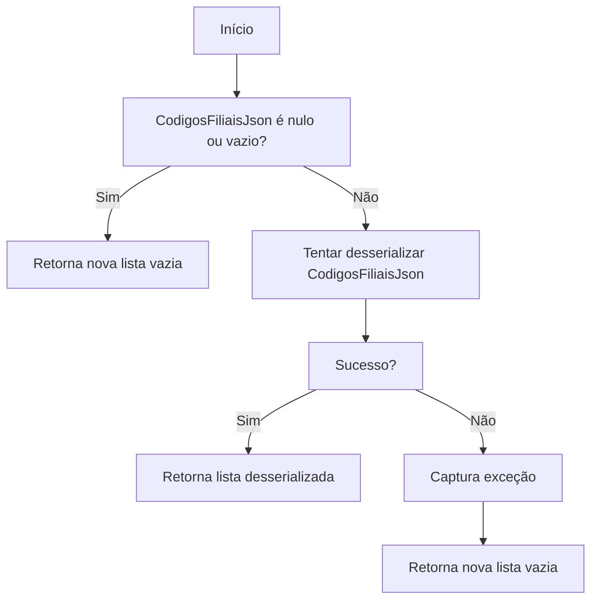
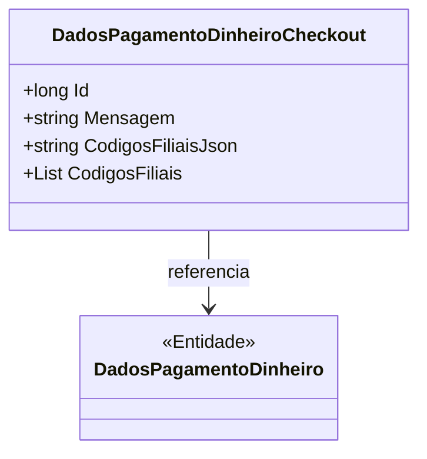

# DadosPagamentoDinheiroCheckout
**Namespace**: IsthmusWinthor.Dominio.Entidades  
**Nome do Arquivo**: DadosPagamentoDinheiroCheckout.cs  

## Visão Geral e Responsabilidade
A classe `DadosPagamentoDinheiroCheckout` é responsável por gerenciar as informações relacionadas ao pagamento em dinheiro durante o processo de checkout. Ela armazena dados relevantes, como mensagens e códigos de filiais, garantindo que essas informações sejam tratadas corretamente ao longo do fluxo de pagamento. O problema de negócio que essa classe resolve é a necessidade de manipular dados de pagamento, incluindo a serialização e desserialização de informações relacionadas às filiais, de forma eficiente e com integridade.

## Métodos de Negócio

### Título: `CodigosFiliais` (Visibilidade: Pública)
- **Objetivo**: Garante que a lista de códigos de filiais seja corretamente serializada e desserializada da representação JSON.
- **Comportamento**: 
  1. No `get`, é verificado se `CodigosFiliaisJson` está nulo ou vazio.
  2. Se estiver vazio, retorna uma nova lista de strings vazia.
  3. Caso contrário, tenta desserializar `CodigosFiliaisJson` em uma lista de strings.
  4. Se a desserialização falhar, captura a exceção e retorna uma nova lista de strings vazia.
  5. No `set`, verifica se o valor atribuído é nulo; caso seja, inicializa uma nova lista de strings.
  6. Serializa a lista de códigos de filiais e a armazena em `CodigosFiliaisJson`.

- **Retorno**: Retorna uma lista de strings representando os códigos das filiais ao acessar `CodigosFiliais`.

## Propriedades Calculadas e de Validação
### Propriedade `CodigosFiliais`
A propriedade `CodigosFiliais` realiza a conversão entre uma representação JSON e uma lista de strings. Essa lógica garante que os dados permanecem consistentes e corretamente formatados para utilização posterior, essencial para o entendimento e manipulação das informações de pagamento.

## Navigations Property
- [DadosPagamentoDinheiro](DadosPagamentoDinheiro.md)

## Tipos Auxiliares e Dependências
- Nenhum enum ou classe estática/auxiliar foi detectado nesta classe.

## Diagrama de Relacionamentos

