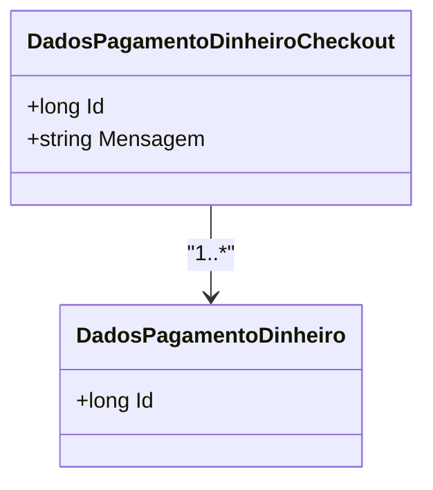

# DadosPagamentoDinheiroCheckout
**Namespace**: IsthmusWinthor.Dominio.Entidades  
**Nome do Arquivo**: DadosPagamentoDinheiroCheckout.cs  

## Visão Geral e Responsabilidade
A classe `DadosPagamentoDinheiroCheckout` representa as informações necessárias para processar um pagamento em dinheiro durante o checkout de um sistema de vendas. Ela é responsável por armazenar dados relacionados aos pagamentos em dinheiro, incluindo a mensagem que pode ser relevante para a transação e a listagem de códigos de filiais associados ao pagamento. A classe resolve o problema de manter a integridade e a estrutura dos dados de pagamento em dinheiro.

## Métodos de Negócio

### Implicit Operator: implicit operator DadosPagamentoDinheiroCheckout(DadosPagamentoDinheiroCheckoutViewModel dadosPagamentoDinheiro)
- **Objetivo**: Facilitar a conversão de um `ViewModel` para a entidade de domínio, garantindo que todos os dados necessários sejam transferidos corretamente.
- **Comportamento**:
  1. Cria uma nova instância de `DadosPagamentoDinheiroCheckout`.
  2. Atribui a `Id` com o valor do `ViewModel`.
  3. Atribui `DadosPagamentoDinheiroId` com o valor correspondente do `ViewModel`.
  4. Usa o método `CodigosFiliais` para garantir que os códigos de filiais sejam manipulados corretamente como uma lista.
  5. Atribui a `Mensagem` utilizando o valor do `ViewModel`.
- **Retorno**: Retorna uma nova instância da classe `DadosPagamentoDinheiroCheckout` populada com os dados do `ViewModel`.

## Propriedades Calculadas e de Validação

### CodigosFiliais
- Esta propriedade é uma lista que fornece uma interface de acesso aos códigos de filiais associados ao pagamento.
- A lógica da propriedade permite que os dados sejam armazenados em formato JSON na propriedade `CodigosFiliaisJson`, garantindo que o acesso e manipulação da lista sejam simples e eficientes. 
- O `get` tenta desserializar os códigos de filiais a partir de um JSON; se não houver dados (JSON vazio ou inválido), retorna uma lista vazia. O `set` serializa a lista, armazenando-a como JSON.

## Navigations Property
- [`DadosPagamentoDinheiro`](DadosPagamentoDinheiro.md): Representa a entidade de pagamento associada ao pagamento em dinheiro.

## Tipos Auxiliares e Dependências
- Não há enums ou classes estáticas específicas listadas como dependências nesta classe.

## Diagrama de Relacionamentos

---
Gerada em 29/12/2025 20:27:14
