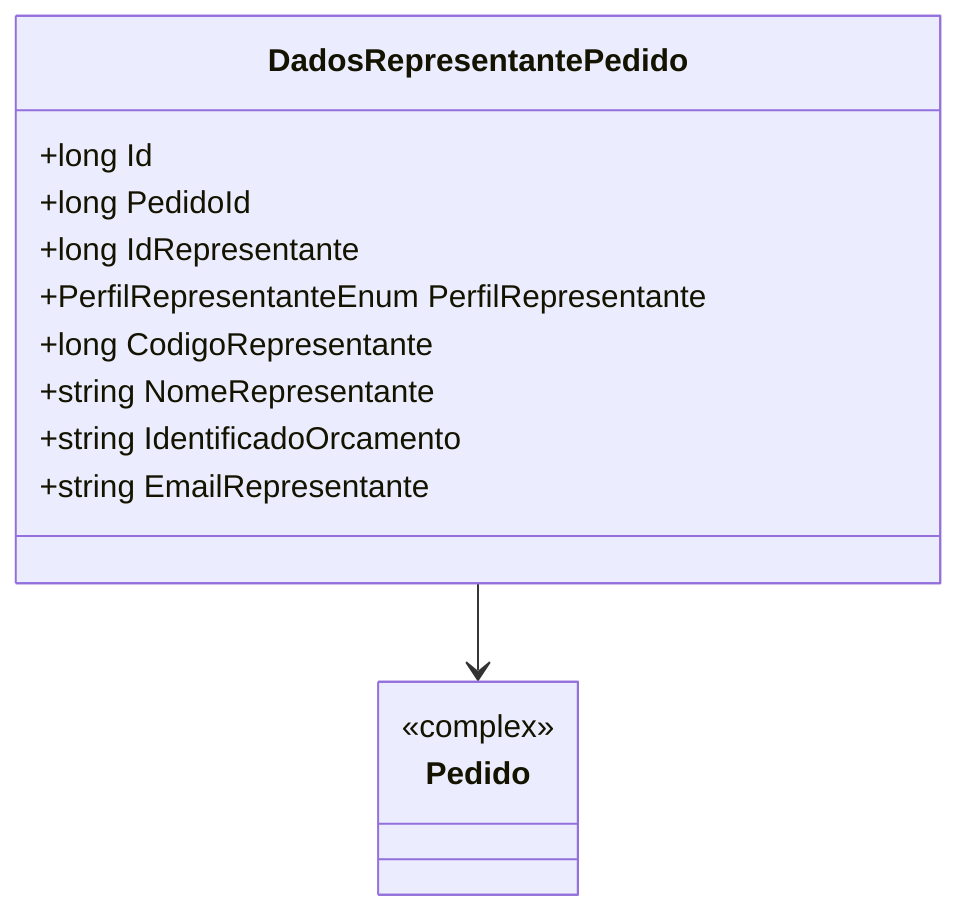

# DadosRepresentantePedido
**Namespace**: IsthmusWinthor.Dominio.Entidades  
**Nome do Arquivo**: DadosRepresentantePedido.cs

## Visão Geral e Responsabilidade
A classe `DadosRepresentantePedido` representa as informações relacionadas ao representante de um pedido dentro do sistema. Ela é responsável por manter a integridade dos dados do representante, incluindo sua identificação e perfil, que são críticos para o correto processamento e atribuição de pedidos. Essa classe resolve o problema de associar um pedido a um representante específico, facilitando o rastreamento e gerenciamento das vendas.

## Propriedades Calculadas e de Validação
- Não há propriedades calculadas ou validações específicas neste domínio; todas as propriedades são simples e anêmicas.

## Navigations Property
- [Pedido](Pedido.md): Representa um relacionamento com a classe `Pedido`, que contém informações detalhadas sobre o pedido ao qual o representante está associado.

## Tipos Auxiliares e Dependências
- [PerfilRepresentanteEnum](PerfilRepresentanteEnum.md): Enum que define os diferentes perfis possíveis para um representante, permitindo validar e categorizar as informações do representante.

## Diagrama de Relacionamentos

---
Gerada em 29/12/2025 20:27:26
