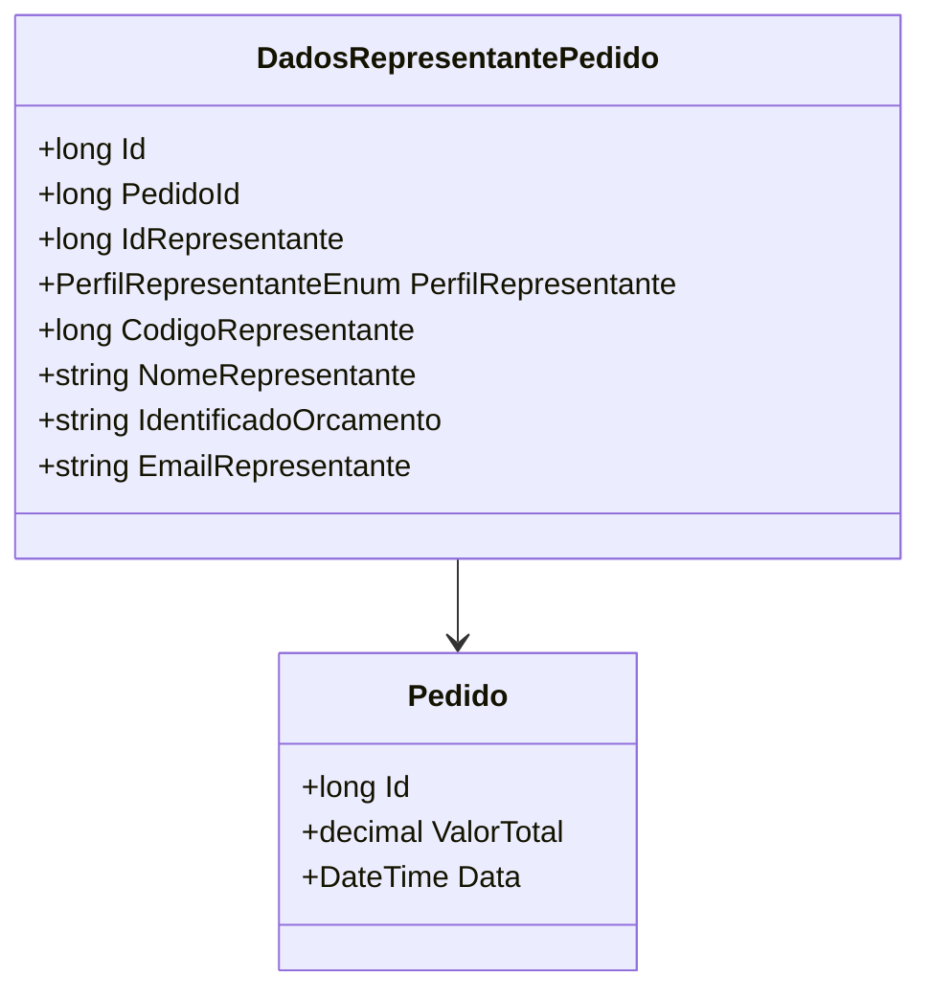

# DadosRepresentantePedido
- **Namespace**: IsthmusWinthor.Dominio.Entidades
- **Nome do Arquivo**: DadosRepresentantePedido.cs

## Visão Geral e Responsabilidade
A classe `DadosRepresentantePedido` representa as informações relevantes sobre o representante de um pedido específico dentro do sistema. Ela é crucial para gerenciar e registrar detalhes como identificação, contato e perfil do representante relacionado ao pedido, resolvendo o problema de acompanhar e associar corretamente representantes a pedidos na plataforma.

## Métodos de Negócio
*Nota: A classe não possui métodos com lógica de negócios, apenas propriedades de dados.*

## Propriedades Calculadas e de Validação
- **EmailRepresentante**: Validação a ser aplicada para garantir que o e-mail adotado esteja em um formato válido. Essa validação deve assegurar a integridade dos dados e a confiabilidade da comunicação.

## Navigations Property
- [Pedido](Pedido.md): Classe complexa que representa o pedido ao qual este dado de representante está associado.

## Tipos Auxiliares e Dependências
- [PerfilRepresentanteEnum](PerfilRepresentanteEnum.md): Enumerador que define os perfis possíveis para um representante, assegurando a consistência dos dados associados.

## Diagrama de Relacionamentos

