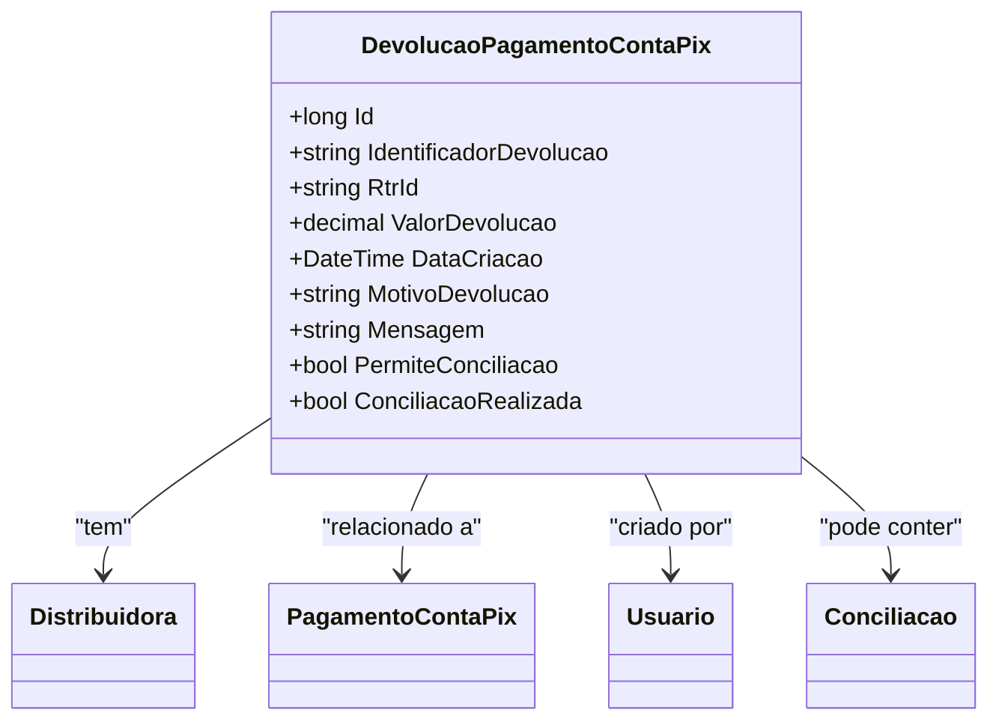

# DevolucaoPagamentoContaPix
- **Namespace**: IsthmusWinthor.Dominio.Entidades
- **Nome do Arquivo**: DevolucaoPagamentoContaPix.cs

## Visão Geral e Responsabilidade
A classe `DevolucaoPagamentoContaPix` representa uma devolução de pagamento realizada via conta Pix. Sua principal responsabilidade é gerenciar informações relacionadas ao processo de devolução, como identificação do usuário que criou a devolução, valor devolvido, e o status da devolução. Essa classe é essencial para garantir que as transações de devolução sejam controladas e registradas corretamente, evitando inconsistências financeiras e possibilitando uma gestão efetiva dos pagamentos devolvidos.

## Métodos de Negócio
### Título: ConciliacaoRealizada (Propriedade)
- **Objetivo**: Garantir se uma conciliação foi realizada com sucesso basendo-se nas regras definidas.
- **Comportamento**: 
  1. Verifica se a propriedade `PermiteConciliacao` é verdadeira.
  2. Verifica se a propriedade `Conciliacao` não é nula.
  3. Verifica se o `NumeroConciliacao` da `Conciliacao` é maior que 0.
- **Retorno**: Retorna um valor booleano que indica se a conciliação foi realizada.

## Propriedades Calculadas e de Validação
- **ConciliacaoRealizada**: Essa propriedade calcula se a conciliação foi efetivamente realizada com base nas condições de permissão estabelecidas para a conciliação e a existência de um número de conciliação. Essa validação é essencial para assegurar que apenas devoluções que possibilitem conciliação sejam consideradas.

## Navigations Property
- [Distribuidora](Distribuidora.md)
- [PagamentoContaPix](PagamentoContaPix.md)
- [Usuario](Usuario.md)
- [Conciliacao](Conciliacao.md)

## Tipos Auxiliares e Dependências
- [StatusDevolucaoPixEnum](StatusDevolucaoPixEnum.md)

## Diagrama de Relacionamentos

Esta documentação técnica visa fornecer uma visão clara sobre as regras de negócio e funcionalidades associadas à classe `DevolucaoPagamentoContaPix`, facilitando a compreensão e o uso adequado no sistema corporativo.
---
Gerada em 29/12/2025 20:27:44
