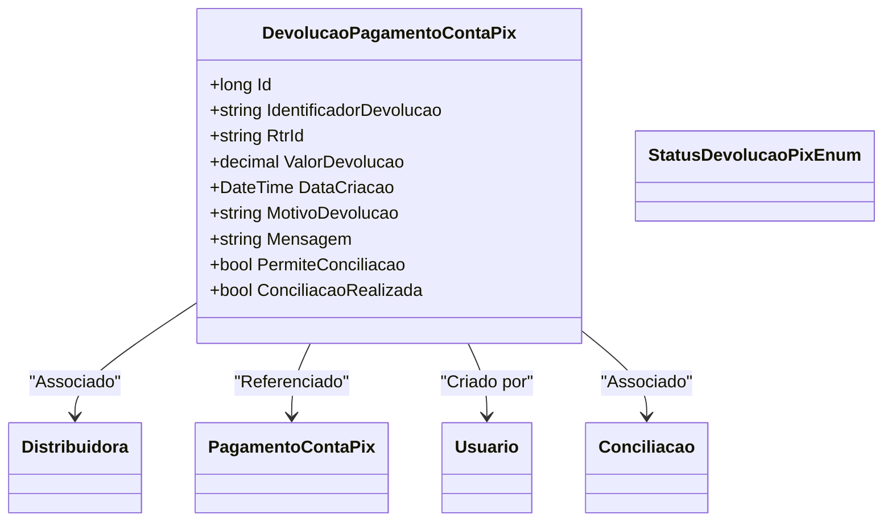

# DevolucaoPagamentoContaPix
**Namespace**: IsthmusWinthor.Dominio.Entidades  
**Nome do Arquivo**: DevolucaoPagamentoContaPix.cs  

## Visão Geral e Responsabilidade
A classe `DevolucaoPagamentoContaPix` representa uma devolução de pagamento realizada através do sistema de pagamentos Pix. Ela desempenha um papel crucial na gestão e rastreamento das devoluções de pagamentos, oferecendo uma estrutura para registrar informações essenciais como o valor da devolução, a distribuidora associada e o status da devolução. Resolve a necessidade de rastrear devoluções, permitindo ao sistema analisar e administrar processos financeiros de maneira eficaz.

## Métodos de Negócio

### Título: ConciliacaoRealizada (Propriedade)
- **Objetivo**: Esta propriedade calcula se uma conciliação foi realizada com base nas condições definidas.
- **Comportamento**: 
  1. Verifica se `PermiteConciliacao` é verdadeiro.
  2. Confirma se a propriedade `Conciliacao` não é nula (ou seja, existe um objeto de conciliação).
  3. Avalia se `NumeroConciliacao` da conciliação é maior que 0.
- **Retorno**: Retorna `true` se a conciliação foi realizada; caso contrário, retorna `false`.

## Propriedades Calculadas e de Validação

### Propriedade: ConciliacaoRealizada
- **Regra**: A propriedade verifica condições de conciliação: a devolução pode ser conciliada se a flag `PermiteConciliacao` for verdadeira, houver um objeto de `Conciliacao` existente e o número de conciliação for maior que 0. Caso contrário, a conciliação não é considerada realizada.

## Navigations Property
- [Distribuidora](Distribuidora.md)
- [PagamentoContaPix](PagamentoContaPix.md)
- [Usuario](Usuario.md)
- [Conciliacao](Conciliacao.md)

## Tipos Auxiliares e Dependências
- [StatusDevolucaoPixEnum](StatusDevolucaoPixEnum.md)

## Diagrama de Relacionamentos

