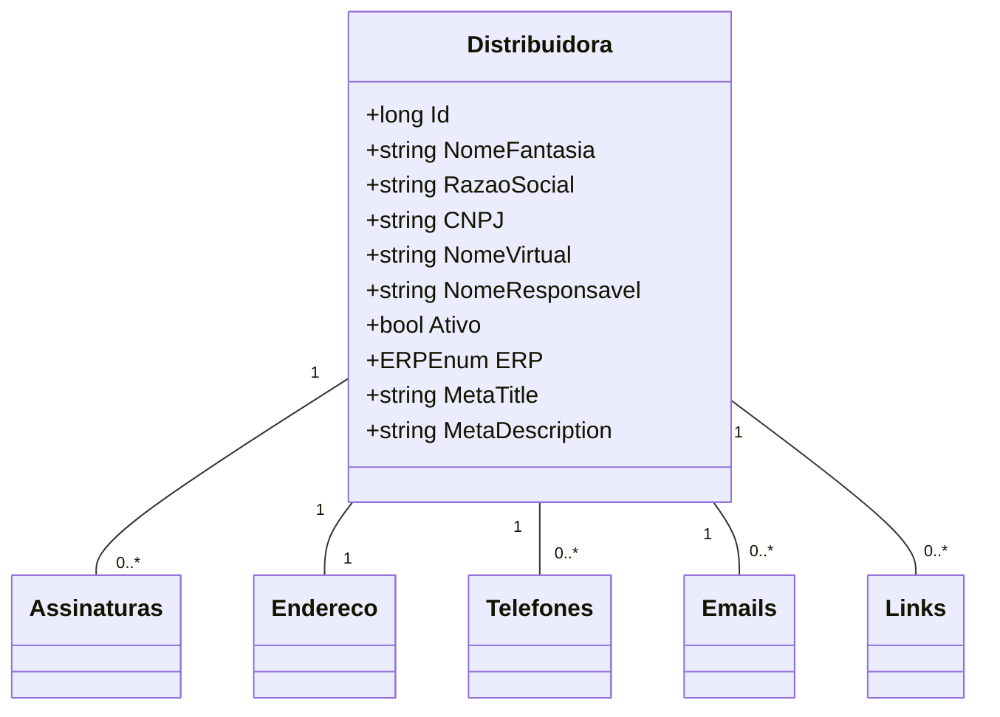

# Distribuidora
**Namespace**: IsthmusWinthor.Dominio.Entidades  
**Nome do Arquivo**: Distribuidora.cs  

## Visão Geral e Responsabilidade
A classe `Distribuidora` representa uma entidade do negócio relacionada a empresas distribuidoras dentro do sistema. Seu papel é gerenciar informações cruciais sobre as distribuidoras, incluindo dados de identificação, estado de ativação e informações de contato. Ela é fundamental para garantir a integridade dos dados ao trabalhar com os assinantes e suas respectivas informações de contato (telefones, e-mails, endereços), além de facilitar a integração com sistemas ERP.

## Métodos de Negócio
*Nota: A classe `Distribuidora` não apresenta métodos com lógica de negócios formalizados além dos getters e setters simples, portanto, não existem métodos a serem documentados nessa seção.*

## Propriedades Calculadas e de Validação
- **Ativo**
  - **Regra:** A propriedade `Ativo` indica se a distribuidora está habilitada ou não para operar no sistema. Quando `false`, a distribuidora não deve ser considerada nas operações de negócio.

## Navigations Property
- [Assinaturas](Assinatura.md) (ICollection<Assinatura>)
- [Endereco](DistribuidoraEndereco.md) (DistribuidoraEndereco)
- [Telefones](DistribuidoraTelefone.md) (ICollection<DistribuidoraTelefone>)
- [Emails](DistribuidoraEmail.md) (ICollection<DistribuidoraEmail>)
- [Links](DistribuidoraLink.md) (ICollection<DistribuidoraLink>)

## Tipos Auxiliares e Dependências
- [ERPEnum](ERPEnum.md)

## Diagrama de Relacionamentos

