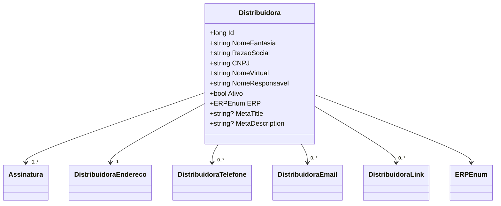

# Distribuidora
**Namespace**: IsthmusWinthor.Dominio.Entidades  
**Nome do Arquivo**: Distribuidora.cs  

## Visão Geral e Responsabilidade
A classe `Distribuidora` representa uma entidade central no domínio, responsável por encapsular as informações e comportamentos relacionados a uma distribuidora. Ela serve como um ponto de referência para gerenciar a identidade da distribuidora, incluindo seus dados cadastrais, contatos e configurações relacionadas à sua operação. O problema de negócio que `Distribuidora` resolve está na organização e no gerenciamento das informações essenciais de distribuidoras, facilitando a integração com outros sistemas e a operação interna da empresa.

## Métodos de Negócio
Esta classe não possui métodos de negócio com lógica complexa a serem documentados.

## Propriedades Calculadas e de Validação
Não existem propriedades na classe `Distribuidora` que implementem lógica de cálculo em seu getter ou validação em seu setter.

## Navigation Properties
- [Assinatura](Assinatura.md) - Representa uma assinatura associada à distribuidora.
- [DistribuidoraEndereco](DistribuidoraEndereco.md) - Representa o endereço da distribuidora.
- [DistribuidoraTelefone](DistribuidoraTelefone.md) - Representa os números de telefone da distribuidora.
- [DistribuidoraEmail](DistribuidoraEmail.md) - Representa os e-mails da distribuidora.
- [DistribuidoraLink](DistribuidoraLink.md) - Representa links associados à distribuidora.

## Tipos Auxiliares e Dependências
- [ERPEnum](ERPEnum.md) - Enumeração que define os diferentes tipos de ERP que a distribuidora pode utilizar.

## Diagrama de Relacionamentos

Esta documentação técnica proporciona um entendimento claro sobre a estrutura e o propósito da classe `Distribuidora`, além de suas relações dentro do domínio e dependências.
---
Gerada em 29/12/2025 20:28:08
