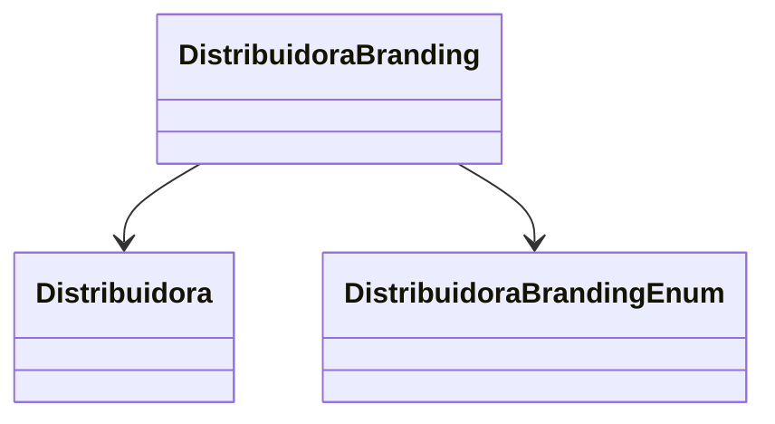

# DistribuidoraBranding
**Namespace**: IsthmusWinthor.Dominio.Entidades  
**Nome do Arquivo**: DistribuidoraBranding.cs  

## Visão Geral e Responsabilidade  
A classe `DistribuidoraBranding` representa uma entidade de domínio responsabilidade de manter informações sobre a configuração de branding de uma distribuidora específica. Ela resolve a necessidade de gestão de branding associada a cada distribuidora, armazenando os dados de autenticação e as características específicas do branding.

## Métodos de Negócio  
Esta classe não possui métodos de negócio que realizem lógica significativa além das operações básicas de acesso aos dados.

## Propriedades Calculadas e de Validação  
- Nenhuma propriedade possui lógica no `get` ou validação no `set` nesta classe.

## Navigation Properties  
- [`Distribuidora`](Distribuidora.md): Representa a relação com a entidade `Distribuidora`, que contém informações detalhadas sobre a distribuidora associada.

## Tipos Auxiliares e Dependências  
- [`DistribuidoraBrandingEnum`](DistribuidoraBrandingEnum.md): Enum que define os possíveis tipos de branding que podem ser aplicados a uma distribuidora.

## Diagrama de Relacionamentos  

