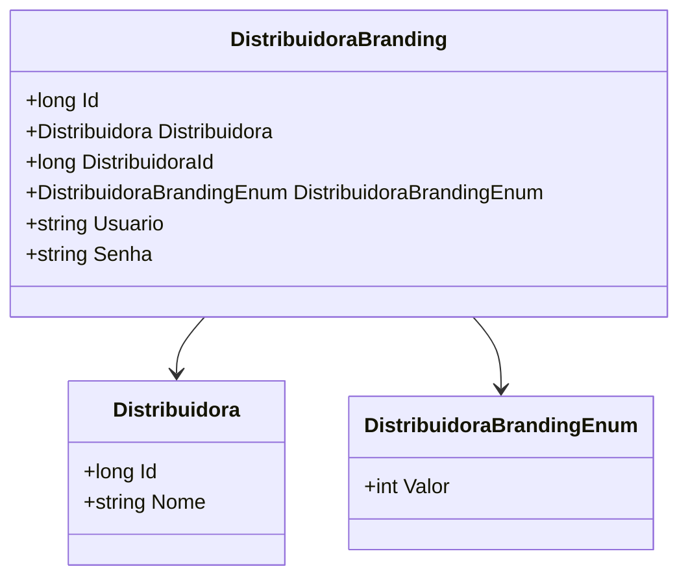

# DistribuidoraBranding
- **Namespace**: IsthmusWinthor.Dominio.Entidades
- **Nome do Arquivo**: DistribuidoraBranding.cs

## Visão Geral e Responsabilidade
A classe `DistribuidoraBranding` representa uma entidade no contexto de branding de distribuidoras, unindo informações relacionadas à distribuição de produtos e aos seus respectivos branding. O problema de negócio que esta classe resolve está relacionado ao gerenciamento e autenticação de marcas associadas a distribuidoras, permitindo que diferentes usuários acessem e administrem o branding de suas distribuidoras de forma segura.

## Métodos de Negócio
- **Título**: (Nenhum método com lógica de negócio foi encontrado nesta classe.)
  
## Propriedades Calculadas e de Validação
- Nenhuma propriedade com lógica no `get` ou validação no `set` foi identificada nesta classe.

## Navigations Property
- Distribuidora: [Distribuidora](Distribuidora.md)

## Tipos Auxiliares e Dependências
- DistribuidoraBrandingEnum: [DistribuidoraBrandingEnum](DistribuidoraBrandingEnum.md)

## Diagrama de Relacionamentos

---
Gerada em 29/12/2025 20:28:17
