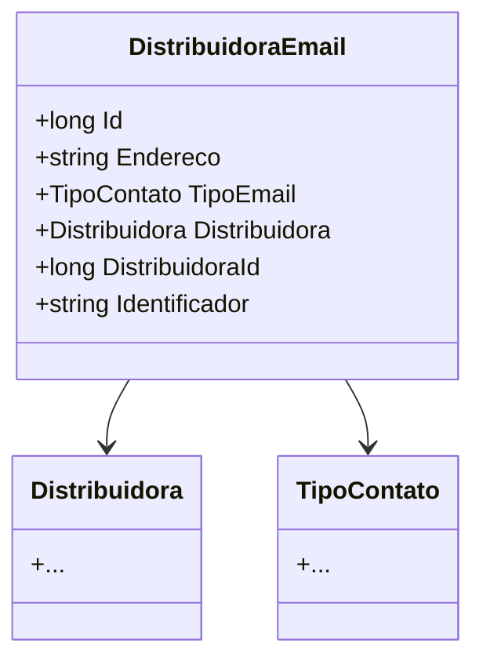

# DistribuidoraEmail
**Namespace**: IsthmusWinthor.Dominio.Entidades  
**Nome do Arquivo**: DistribuidoraEmail.cs  

## Visão Geral e Responsabilidade
A classe `DistribuidoraEmail` representa um modelo do domínio que encapsula informações sobre os e-mails de contato de uma distribuidora. Ela é responsável por garantir que os e-mails estejam vinculados a uma distribuidora específica e categorizados de acordo com o tipo de contato. O objetivo principal é facilitar a gestão e a comunicação por e-mail dentro do sistema.

## Propriedades Calculadas e de Validação
- **Endereco**
  - Esta propriedade deve armazenar um e-mail válido. A validação deve ser implementada para garantir que o formato do e-mail esteja correto antes de ser atribuído.

- **TipoEmail**
  - Esta propriedade deve assegurar que o tipo de contato associado ao e-mail seja apropriado para a função específica no contexto da distribuidora.

## Navigations Property
- `[Distribuidora](Distribuidora.md)`: Esta propriedade representa a relação com a classe `Distribuidora`, indicando que a `DistribuidoraEmail` está associada a uma única distribuidora.

## Tipos Auxiliares e Dependências
- `[TipoContato](TipoContato.md)`: Este enumerador define os possíveis tipos de e-mail de contato (ex: Comercial, Suporte, etc.) utilizados na classe `DistribuidoraEmail`.

## Diagrama de Relacionamentos

