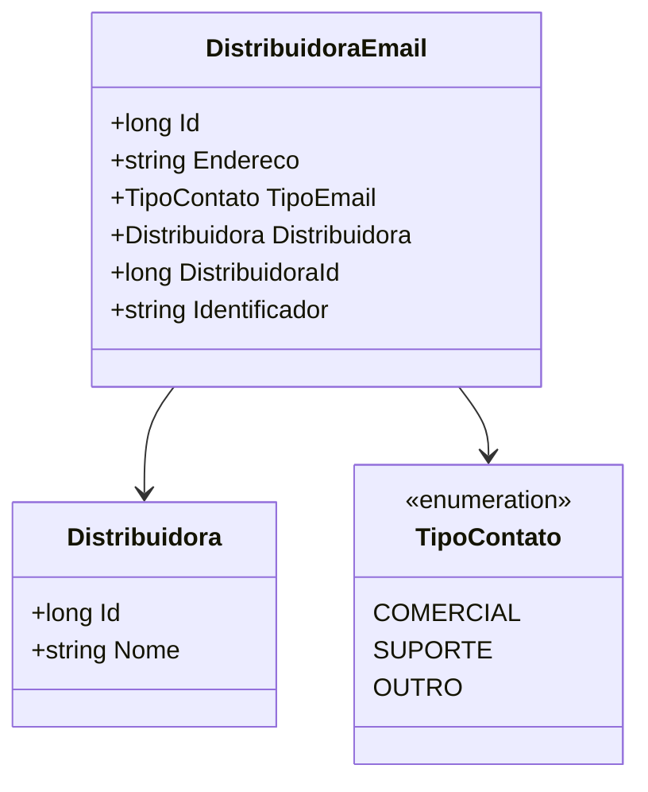

# DistribuidoraEmail

**Namespace**: IsthmusWinthor.Dominio.Entidades  
**Nome do Arquivo**: DistribuidoraEmail.cs  

## Visão Geral e Responsabilidade
A classe `DistribuidoraEmail` representa a entidade que relaciona um endereço de e-mail a uma distribuidora específica. Essa classe é fundamental para o gerenciamento dos contatos de e-mail das distribuidoras, permitindo que o sistema mantenha registros de comunicação de forma organizada e eficiente. O problema de negócio que ela resolve é garantir que cada distribuidora tenha um ou mais e-mails associados, permitindo que a comunicação com clientes e fornecedores possa ser feita de maneira eficaz.

## Métodos de Negócio
- **Título**: Nenhum método de negócio complexo encontrado.  
  - **Objetivo**: N/A  
  - **Comportamento**: N/A  
  - **Retorno**: N/A  

## Propriedades Calculadas e de Validação
- `Endereco`: Esta propriedade armazena o endereço de e-mail e deve ser validada no momento da inserção ou atualização, garantindo que o formato do e-mail esteja correto. Regra de validação: um endereço de e-mail deve conter um "@" e um domínio válido.

## Navigations Property
- [Distribuidora](Distribuidora.md): Representa a classe que define a distribuidora associada a este e-mail.

## Tipos Auxiliares e Dependências
- [TipoContato](TipoContato.md): Enum que categoriza o tipo de contato do e-mail (por exemplo, comercial, suporte).

## Diagrama de Relacionamentos

---
Gerada em 29/12/2025 20:28:29
