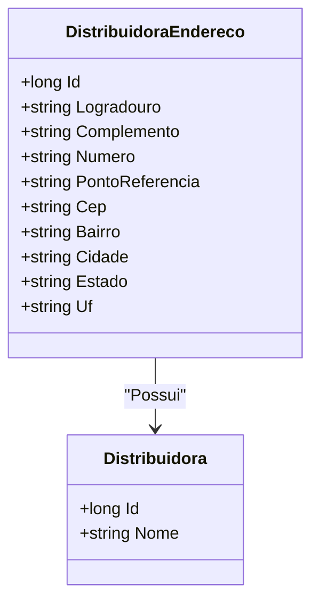

# DistribuidoraEndereco
**Namespace**: IsthmusWinthor.Dominio.Entidades  
**Nome do Arquivo**: DistribuidoraEndereco.cs  

## Visão Geral e Responsabilidade
A classe `DistribuidoraEndereco` representa o local de um distribuidor, encapsulando suas informações geográficas e administrativas. Ela resolve o problema de associar um endereço específico a um distribuidor, permitindo a identificação e comunicação eficaz entre os distribuidores e as entidades que interagem com eles, como clientes e sistemas de logística.

## Propriedades Calculadas e de Validação
Não há propriedades com lógica de cálculo ou validação no `get` ou `set`.

## Navigations Property
- [Distribuidora](Distribuidora.md)

## Tipos Auxiliares e Dependências
Não há enumeradores ou classes estáticas/helpers utilizadas diretamente nesta classe.

## Diagrama de Relacionamentos

---
Gerada em 29/12/2025 20:28:35
