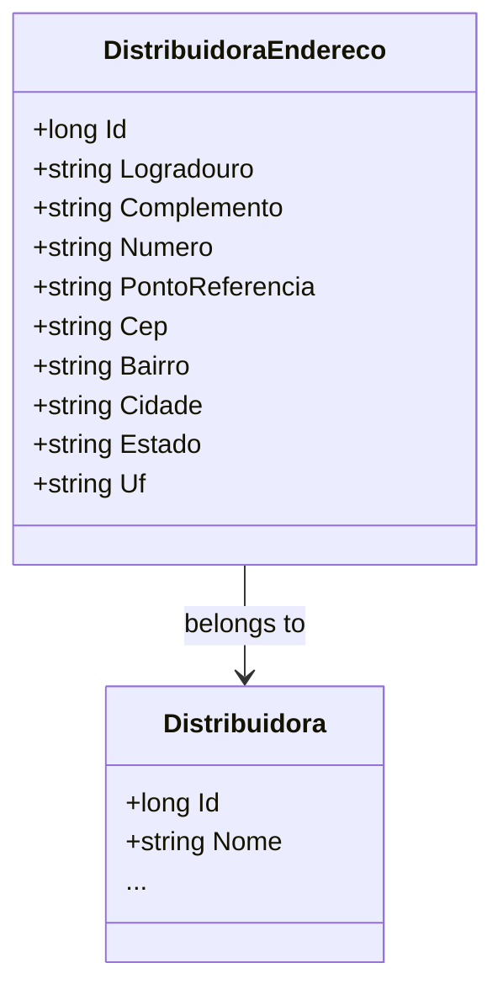

# DistribuidoraEndereco
- **Namespace**: IsthmusWinthor.Dominio.Entidades
- **Nome do Arquivo**: DistribuidoraEndereco.cs

## Visão Geral e Responsabilidade
A classe `DistribuidoraEndereco` representa o endereço de uma distribuidora no sistema. Esta classe é crucial para a gestão e localização das distribuidoras, permitindo que o sistema armazene informações precisas sobre onde cada distribuidora está situada, o que é essencial para operações logísticas, entrega de produtos e comunicação com os clientes.

## Navegação de Propriedades
- `Distribuidora`: Uma classe complexa que representa a distribuidora à qual este endereço está associado. 
  - [Distribuidora](Distribuidora.md)

## Tipos Auxiliares e Dependências
Esta classe não utiliza enumeradores ou classes de ajuda externas.

## Diagrama de Relacionamentos

O diagrama acima ilustra a relação entre a classe `DistribuidoraEndereco` e a classe `Distribuidora`, mostrando que cada endereço de distribuidora está associado a uma única distribuidora.
