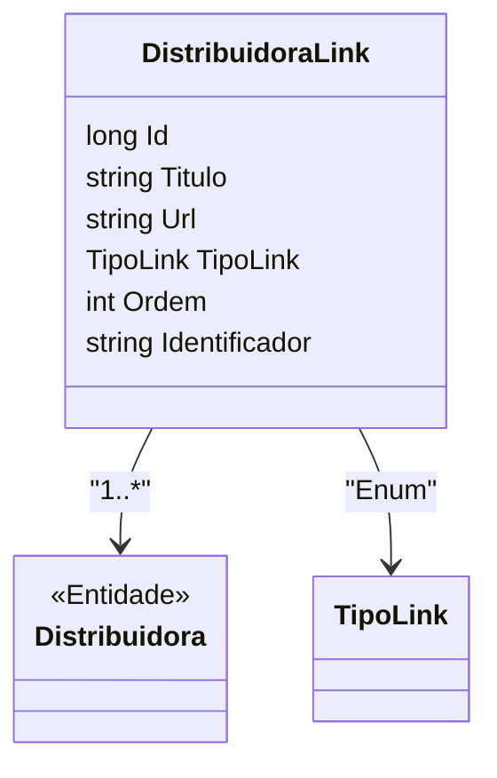

# DistribuidoraLink
**Namespace**: IsthmusWinthor.Dominio.Entidades  
**Nome do Arquivo**: DistribuidoraLink.cs  

## Visão Geral e Responsabilidade
A classe `DistribuidoraLink` representa um vínculo entre uma distribuidora e um link associado (como uma URL ou referência). Ela é responsável por armazenar informações relevantes sobre o link, incluindo seu título, a URL em si, um identificador único e a ordem de exibição. Este modelo ajuda na organização e apresentação dos links de maneira que cada distribuidora possa ter uma ou várias referências úteis categorizadas.

## Métodos de Negócio
Não existem métodos com lógica de negócio complexa nesta classe, apenas propriedades que armazenam informações.

## Propriedades Calculadas e de Validação
Não existem propriedades calculadas ou validações específicas na classe `DistribuidoraLink`.

## Navigation Property
- [Distribuidora](Distribuidora.md)

## Tipos Auxiliares e Dependências
- [TipoLink](TipoLink.md)

## Diagrama de Relacionamentos

---
Gerada em 29/12/2025 20:28:41
