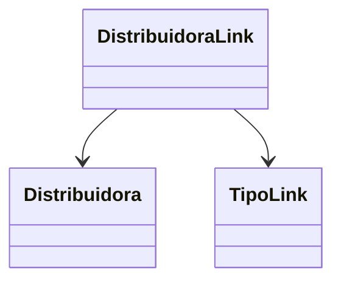

# DistribuidoraLink

**Namespace**: IsthmusWinthor.Dominio.Entidades  
**Nome do Arquivo**: DistribuidoraLink.cs  

## Visão Geral e Responsabilidade
A classe `DistribuidoraLink` representa um vínculo entre uma distribuidora e um link associado a ela. O objetivo principal é facilitar o gerenciamento e a apresentação de links relevantes para a distribuidora, garantindo que cada link seja adequadamente identificado e ordenado. Isso resolve o problema de estruturação e organização dos links associados a distribuidoras no sistema.

## Métodos de Negócio
*Observação: A classe não possui métodos com lógica de negócio, somente propriedades.*

## Propriedades Calculadas e de Validação
- **Identificador**: Esta propriedade deve conter um valor único que identifique a instância da `DistribuidoraLink`. A regra por trás da validação é que o identificador deve ser gerado ou atribuído de forma a garantir a unicidade no contexto da aplicação.

## Navigations Property
- [`Distribuidora`](Distribuidora.md): Representa a distribuidora associada a este link.

## Tipos Auxiliares e Dependências
- [`TipoLink`](TipoLink.md): Enum que define os tipos de links que podem ser associados a uma `DistribuidoraLink`.

## Diagrama de Relacionamentos

