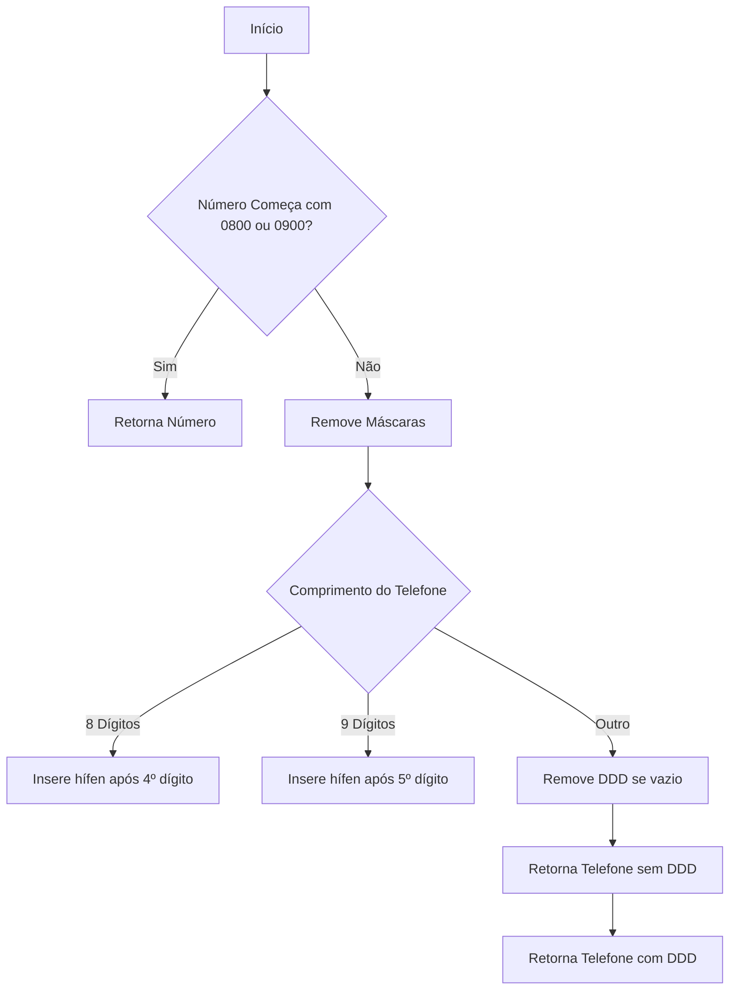
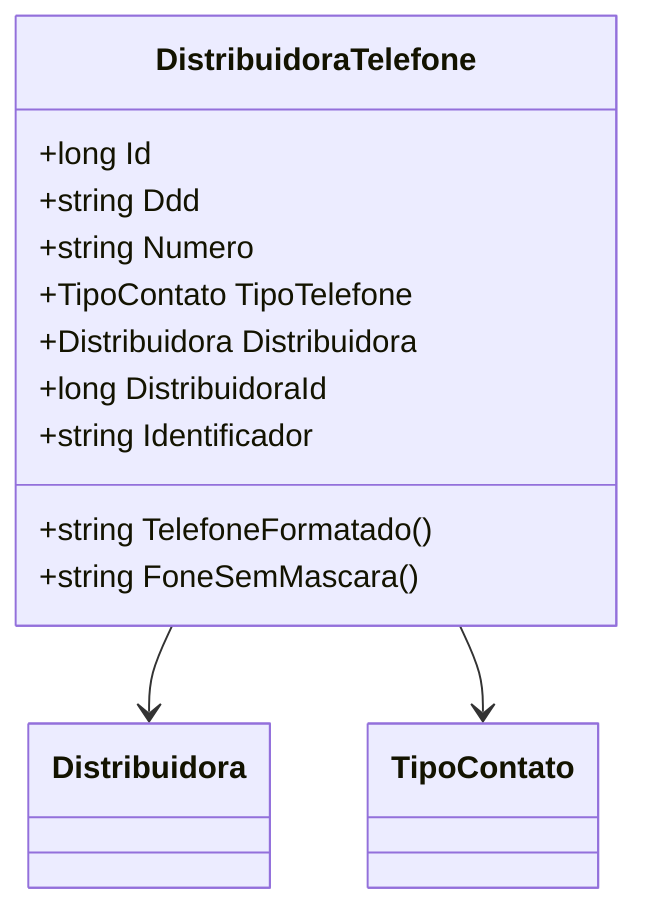

# DistribuidoraTelefone
**Namespace**: IsthmusWinthor.Dominio.Entidades  
**Nome do Arquivo**: DistribuidoraTelefone.cs  

## Visão Geral e Responsabilidade
A classe `DistribuidoraTelefone` representa as informações de contato telefônico associadas a uma distribuidora, gerenciando a formatação e a validação do número de telefone. Ela resolve o problema de inconsistências na apresentação de números telefônicos e fornece métodos para manipulação e extração dos números formatados ou não, garantindo que as informações de contato sejam armazenadas e acessadas de forma correta.

## Métodos de Negócio

### TelefoneFormatado() - Public
- **Objetivo**: Garante que o número de telefone seja retornado em um formato consistente e legível, tanto para números fixos quanto para celulares, além de lidar com números 0800 e 0900 que não precisam de formatação.
- **Comportamento**: 
  1. Verifica se o número começa com "0800" ou "0900", retornando-o inalterado se sim.
  2. Chama o método `RemoverMascaras()` para obter o número e DDD sem caracteres especiais.
  3. Avalia o comprimento do número:
     - Se tem 8 dígitos, insere um hífen após o quarto dígito.
     - Se tem 9 dígitos, insere um hífen após o quinto dígito.
  4. Se o DDD está vazio, retorna somente o número formatado; caso contrário, retorna o número com o DDD formatado.
- **Retorno**: Retorna o número de telefone formatado como uma string.

### FoneSemMascara() - Public
- **Objetivo**: Fornece o número de telefone concatenado sem máscara, útil para armazenamento ou processamento onde a formatação não é necessária.
- **Comportamento**: Chama o método `RemoverMascaras()` e concatena o DDD e o número, retornando uma string sem formatação.
- **Retorno**: Retorna o número de telefone sem máscara como uma string.

### RemoverMascaras() - Private
- **Objetivo**: Elimina caracteres não numéricos do DDD e do número de telefone para facilitar a manipulação futura.
- **Comportamento**: 
  1. Verifica se o número e o DDD estão presentes e remove as máscaras.
  2. Avalia se o telefone contém DDD:
     - Se sim, separa o DDD dos números; caso contrário, trata o telefone como fixo ou celular.
- **Retorno**: Retorna uma tupla contendo o DDD e o número sem máscara, prontos para uso.

## Propriedades Calculadas e de Validação
- As propriedades `Ddd` e `Numero` possuem a lógica de validação pela estrutura dos métodos. A classe garante que apenas números válidos sejam processados.

## Navigations Property
- [Distribuidora](Distribuidora.md)

## Tipos Auxiliares e Dependências
- [TipoContato](TipoContato.md)

## Diagrama de Relacionamentos

---
Gerada em 29/12/2025 20:29:01
