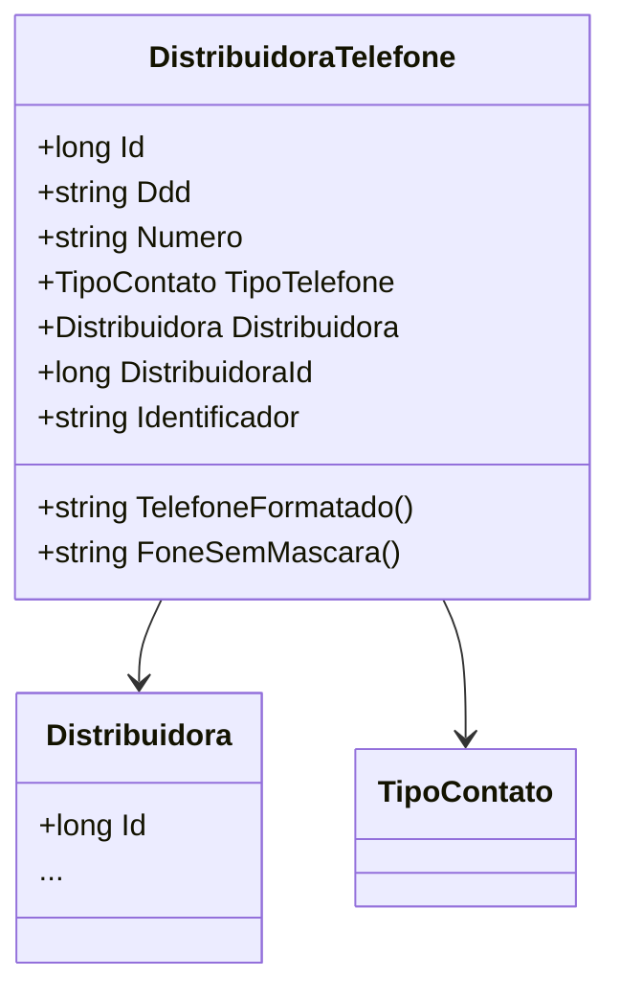

# DistribuidoraTelefone
**Namespace**: IsthmusWinthor.Dominio.Entidades  
**Nome do Arquivo**: DistribuidoraTelefone.cs  

## Visão Geral e Responsabilidade
A classe `DistribuidoraTelefone` representa um número de telefone associado a uma distribuidora. Sua responsabilidade principal é garantir que o formato e a estrutura dos números de telefone estejam corretos, incluindo a manipulação de DDDs e a formatação de números, de acordo com as regras de negócio estabelecidas. Este modelo é essencial no contexto de comunicação da distribuidora, onde informações de contato precisas são necessárias para interações comerciais.

## Métodos de Negócio

### TelefoneFormatado() 
- **Objetivo**: Garante que o número de telefone esteja formatado corretamente para apresentação e utilização em contextos de comunicação.
- **Comportamento**: 
  1. Verifica se o número começa com "0800" ou "0900", retornando-o caso afirmativo, pois esses números têm formatação específica.
  2. Chama o método `RemoverMascaras()` para obter o número sem formatação.
  3. Com base no comprimento do número, aplica a formatação adequada. 
     - Se o número tiver 8 dígitos, insere um hífen na posição correta.
     - Se o número tiver 9 dígitos, insere um hífen na posição correta.
  4. Verifica se o DDD está vazio e, caso contrário, retorna o número formatado com o DDD; se estiver vazio, retorna somente o número.
- **Retorno**: Retorna o número de telefone formatado como uma string.

```mermaid
flowchart TD
    A[Início] --> B{Numero começa com 0800 ou 0900?}
    B -- Sim --> C[Retorna Numero]
    B -- Não --> D[Chama RemoverMascaras()]
    D --> E{Telefone possui DDD?}
    E -- Sim --> F[Retorna "(DDD) TelefoneFormatado"]
    E -- Não --> G[Retorna "TelefoneFormatado"]
```

### FoneSemMascara()
- **Objetivo**: Garante que o número de telefone e DDD sejam retornados em uma forma bruta, sem formatação.
- **Comportamento**: 
  1. Chama o método `RemoverMascaras()` para obter o número e DDD sem caracteres não numéricos.
  2. Concatenando o DDD e o telefone, retorna a string resultante.
- **Retorno**: Retorna o número de telefone e DDD concatenados como uma string.

### RemoverMascaras()
- **Objetivo**: Internaliza a lógica de remoção de caracteres não numéricos, facilitando a extração do DDD e do número do telefone.
- **Comportamento**:
  1. Remove todos os caracteres não numéricos do número e do DDD.
  2. Se o número sem máscara já contiver um DDD (no caso de ter 10 ou 11 dígitos), ele é extraído e o número é ajustado.
- **Retorno**: Retorna uma tupla com DDD e telefone sem máscaras na forma de strings.

## Propriedades Calculadas e de Validação
- Não existem propriedades com lógica no `get` ou validação no `set` na classe `DistribuidoraTelefone`.

## Navigations Property
- `[Distribuidora](Distribuidora.md)`: Propriedade que representa a associação da classe `Distribuidora`.

## Tipos Auxiliares e Dependências
- `[TipoContato](TipoContato.md)`: Enum utilizado para especificar o tipo de telefone (ex: fixo, celular, etc.).

## Diagrama de Relacionamentos

