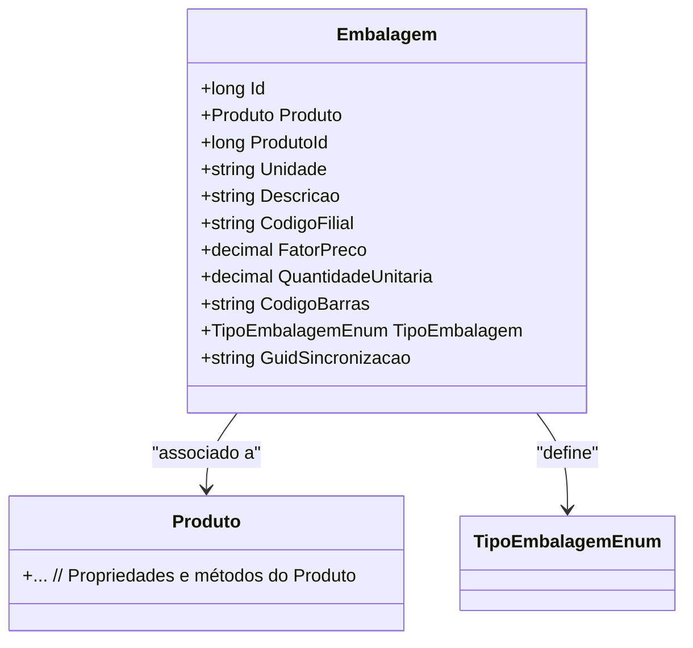

# Embalagem
**Namespace**: IsthmusWinthor.Dominio.Entidades  
**Nome do Arquivo**: Embalagem.cs  

## Visão Geral e Responsabilidade
A classe `Embalagem` representa a estrutura e as características de uma unidade de embalagem de um produto no sistema. Esta classe é fundamental para o gerenciamento do estoque e da logística, pois define como os produtos são agrupados e transportados, incluindo informações como quantidade, tipo de embalagem e codificação para rastreamento. O controle adequado da embalagem ajuda a garantir que os produtos cheguem ao destino em condições adequadas e que os dados de inventário sejam precisos.

## Métodos de Negócio
A classe `Embalagem` não possui métodos de negócio com lógica complexa implementados que se enquadrem na definição dada, consistindo apenas em propriedades.

## Propriedades Calculadas e de Validação
A classe possui várias propriedades simples, sem validação ou lógica computacional em seus `getters` ou `setters`. No entanto, as propriedades são definidas de forma a assegurar a integridade dos dados da embalagem.

## Navigations Property
- `Produto`: [Produto](Produto.md) - Representa a associação da embalagem a um produto.

## Tipos Auxiliares e Dependências
- `TipoEmbalagemEnum`: [TipoEmbalagemEnum](TipoEmbalagemEnum.md) - Enum que classifica os tipos de embalagem disponíveis.

## Diagrama de Relacionamentos

---
Gerada em 29/12/2025 20:29:13
