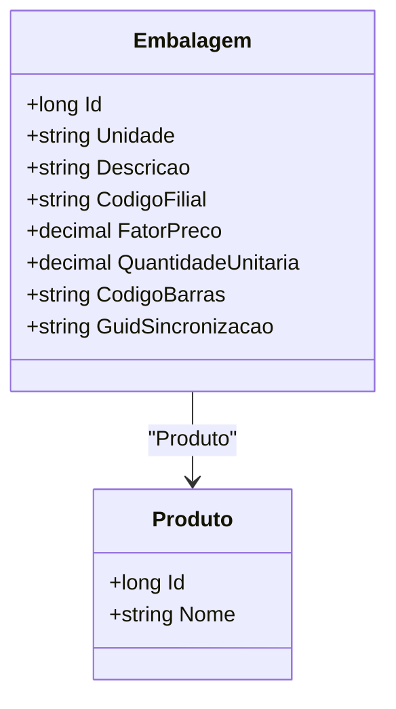

# Embalagem
**Namespace**: IsthmusWinthor.Dominio.Entidades  
**Nome do Arquivo**: Embalagem.cs  

## Visão Geral e Responsabilidade
A classe `Embalagem` representa uma entidade do modelo de domínio relacionada a produtos que precisam ser embalados para venda. Ela captura informações essenciais sobre a embalagem de um produto, como unidade de medida, descrição, código de filial e dados de sincronização. O objetivo principal dessa classe é integrar e garantir a integridade dos dados relativos às embalagens e suas associações com produtos no sistema, assegurando que as informações sobre como um produto pode ser embalado e vendido sejam mantidas de forma consistente.

## Métodos de Negócio
* **Título**: Este código não contém métodos complexos de negócio, apenas propriedades de estado que não possuem lógicas específicas definidas como métodos. Portanto, não há métodos de negócio a serem documentados nesta classe.

## Propriedades Calculadas e de Validação
- Nenhuma propriedade com lógica de `get` ou validação no `set` foi identificada. Todas as propriedades são simples e representativas de dados.

## Navigations Property
- [Produto](Produto.md): Representa uma referência ao produto que está associado a esta embalagem.

## Tipos Auxiliares e Dependências
- [TipoEmbalagemEnum](TipoEmbalagemEnum.md): Enum que define os tipos de embalagem que podem ser utilizados. 

## Diagrama de Relacionamentos

A classe `Embalagem` relaciona-se diretamente à classe `Produto`, indicando que cada embalagem está associada a exatamente um produto.
