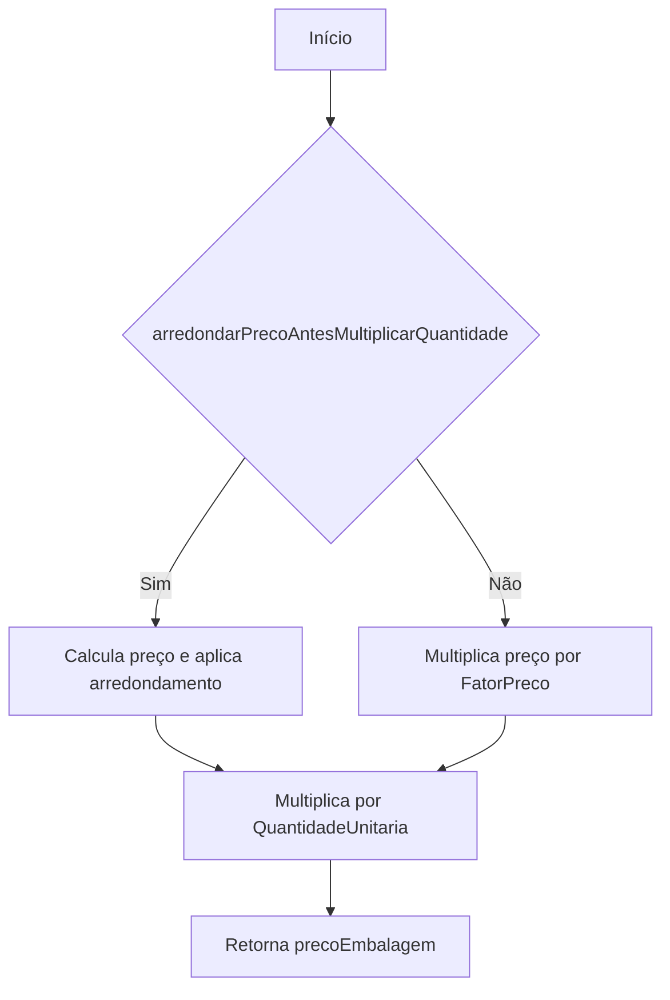
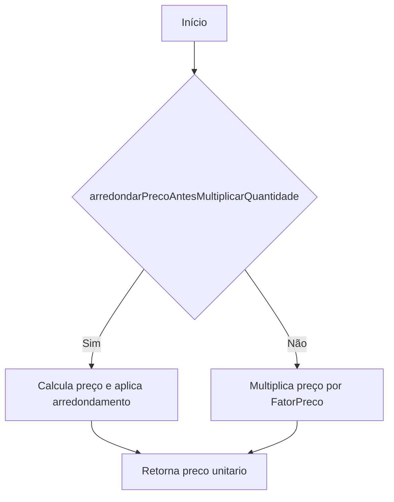
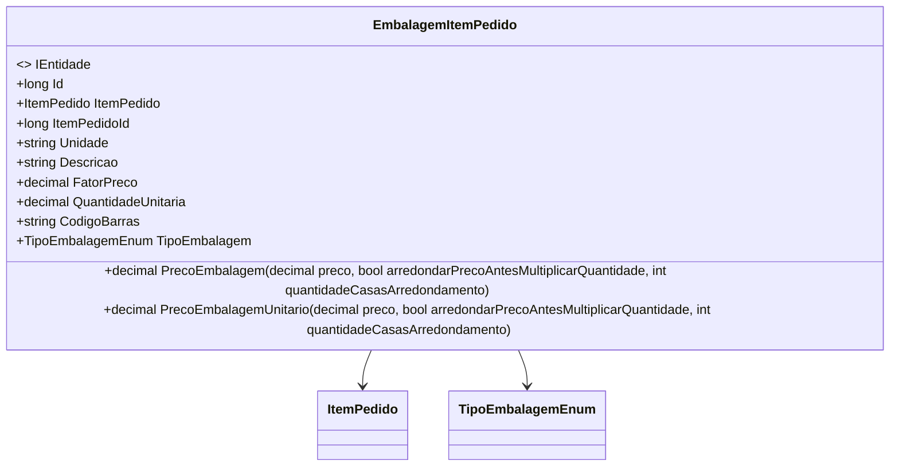

# EmbalagemItemPedido
**Namespace**: IsthmusWinthor.Dominio.Entidades  
**Nome do Arquivo**: EmbalagemItemPedido.cs  

## Visão Geral e Responsabilidade
A classe `EmbalagemItemPedido` representa um item de embalagem dentro de um pedido. Sua principal responsabilidade é calcular o preço total e o preço unitário da embalagem, considerando diversos fatores como fator de preço e arredondamento. Isso assegura que a precificação das embalagens seja feita de forma consistente e precisa, atendendo às necessidades do sistema de venda.

## Métodos de Negócio

### Título: PrecoEmbalagem (public)
- **Objetivo**: Calcular o preço total da embalagem baseado no preço do item, fator de preço e quantidade.
- **Comportamento**: 
  1. Inicializa `precoEmbalagem` como 0.
  2. Se `arredondarPrecoAntesMultiplicarQuantidade` for verdadeiro:
     - Multiplica o preço pelo `FatorPreco`.
     - Arredonda o resultado com base no `quantidadeCasasArredondamento`.
     - Multiplica o resultado pela `QuantidadeUnitaria`.
  3. Se `arredondarPrecoAntesMultiplicarQuantidade` for falso:
     - Faz a multiplicação direta do preço pelo `FatorPreco` e depois pela `QuantidadeUnitaria`.
  4. Retorna o valor calculado para `precoEmbalagem`.
- **Retorno**: O preço total da embalagem em formato decimal.

### Título: PrecoEmbalagemUnitario (public)
- **Objetivo**: Calcular o preço unitário da embalagem, considerando o preço e o fator de preço.
- **Comportamento**: 
  1. Se `arredondarPrecoAntesMultiplicarQuantidade` for verdadeiro:
     - Multiplica o preço pelo `FatorPreco`.
     - Arredonda o resultado com base no `quantidadeCasasArredondamento`.
  2. Se `arredondarPrecoAntesMultiplicarQuantidade` for falso:
     - Retorna a multiplicação direta do preço pelo `FatorPreco`.
- **Retorno**: O preço unitário da embalagem em formato decimal.

## Propriedades Calculadas e de Validação
- Não existem propriedades com lógica no `get` ou validações específicas de `set` nesta classe.

## Navigations Property
- [ItemPedido](ItemPedido.md)

## Tipos Auxiliares e Dependências
- [TipoEmbalagemEnum](TipoEmbalagemEnum.md)

## Diagrama de Relacionamentos

Esta documentação fornece uma visão clara das regras de negócio associadas à classe `EmbalagemItemPedido`, permitindo que desenvolvedores e stakeholders entendam rapidamente a sua finalidade e funcionamento dentro do sistema.
---
Gerada em 29/12/2025 20:29:39
