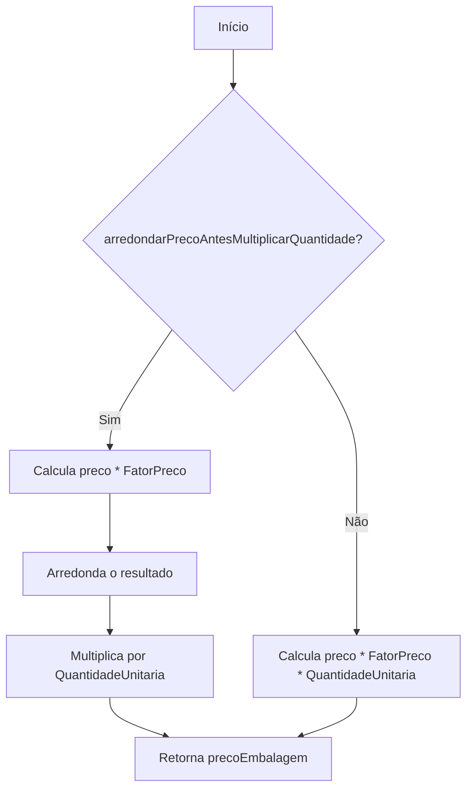
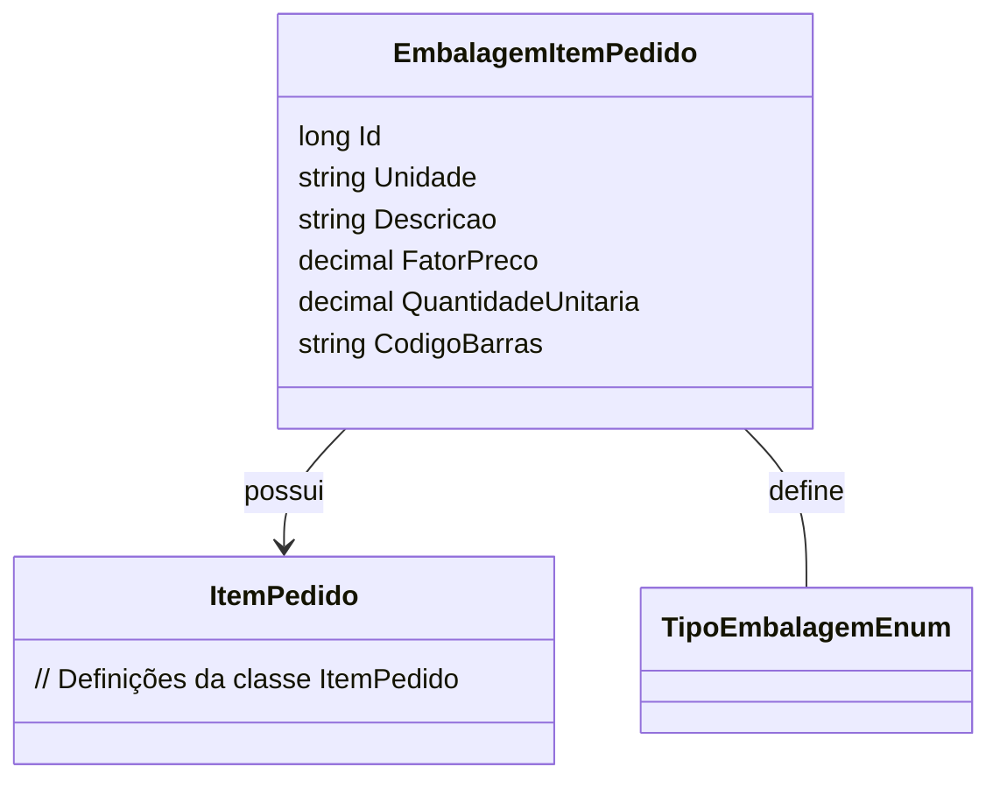

# EmbalagemItemPedido
**Namespace**: IsthmusWinthor.Dominio.Entidades  
**Nome do Arquivo**: EmbalagemItemPedido.cs  

## Visão Geral e Responsabilidade
A classe `EmbalagemItemPedido` representa a embalagem de um item pedido dentro de um sistema de pedidos. Sua principal responsabilidade é calcular o preço da embalagem com base em fatores como o preço unitário do item, o fator de preço associado à embalagem e a quantidade solicitada, permitindo um controle detalhado de custos de embalagem em processos de vendas.

## Métodos de Negócio

### Título: PrecoEmbalagem (public)
**Objetivo**: Este método garante a correta aplicação do cálculo de preço da embalagem, considerando se o arredondamento deve ser feito antes ou depois da multiplicação da quantidade.

**Comportamento**:
1. Inicializa `precoEmbalagem` como 0.
2. Se `arredondarPrecoAntesMultiplicarQuantidade` é verdadeiro:
   - Calcula o preço multiplicando o `preco` pelo `FatorPreco`.
   - Aplica arredondamento no resultado com o número de casas decimais especificado.
   - Multiplica o resultado arredondado por `QuantidadeUnitaria`.
3. Se não:
   - Calcula o `precoEmbalagem` multiplicando `preco`, `FatorPreco` e `QuantidadeUnitaria` diretamente.
4. Retorna o valor calculado de `precoEmbalagem`.

**Retorno**: O valor retornado é o preço total da embalagem, considerando as multiplicações e possíveis arredondamentos.

### Título: PrecoEmbalagemUnitario (public)
**Objetivo**: O método calcula o preço unitário da embalagem de um item, permitindo verificar rapidamente o custo por unidade antes de aplicar o fator de quantidade.

**Comportamento**:
1. Se `arredondarPrecoAntesMultiplicarQuantidade` é verdadeiro:
   - Calcula o preço multiplicando `preco` pelo `FatorPreco`.
   - Aplica arredondamento ao resultado com o número de casas decimais especificado.
2. Se não:
   - Multiplica diretamente o `preco` pelo `FatorPreco`.
3. Retorna o valor calculado.

**Retorno**: O retorno é o preço unitário da embalagem, seja arredondado ou não, dependendo da configuração.

## Propriedades Calculadas e de Validação
Nenhuma propriedade com lógica de cálculo ou validação foi identificada neste modelo, todas as propriedades são simples.

## Navigation Property
- `[ItemPedido](ItemPedido.md)`: Representa o pedido associado a esta embalagem.

## Tipos Auxiliares e Dependências
- `[TipoEmbalagemEnum](TipoEmbalagemEnum.md)`: Enum que define os tipos de embalagem.

## Diagrama de Relacionamentos

