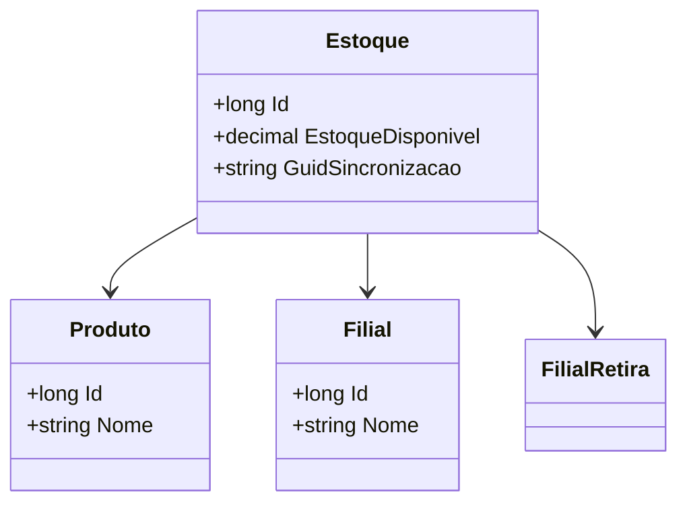

# Estoque
**Namespace**: IsthmusWinthor.Dominio.Entidades  
**Nome do Arquivo**: Estoque.cs  

## Visão Geral e Responsabilidade
A classe `Estoque` representa a entidade de controle de estoque para produtos em uma ou mais filiais. Ela é responsável por manter o estado atual do inventário disponível de um determinado produto, além de associar a informação a diferentes filiais. O problema de negócio que `Estoque` resolve é a necessidade de gerenciar a quantidade de produtos disponíveis e o rastreamento de onde esses produtos estão localizados, permitindo uma eficiente administração do inventário e controle logístico.

## Métodos de Negócio
Nessa classe, não existem métodos com lógica de negócio complexa a serem documentados, dado que a funcionalidade é essencialmente de armazenamento de dados.

## Propriedades Calculadas e de Validação
Atualmente, esta classe não possui propriedades com lógica no `get` ou validação no `set`; todas as propriedades são de acesso direto.

## Navigation Property
- [Produto](Produto.md): Classe complexa que representa o produto associado ao estoque.
- [Filial](Filial.md): Classe complexa que representa a filial onde o estoque é armazenado.
- [FilialRetira](Filial.md): Classe complexa que representa a filial de onde o estoque pode ser retirado.

## Tipos Auxiliares e Dependências
- Não são utilizados Enums ou Classes Estáticas/Helpers nesta classe.

## Diagrama de Relacionamentos

---
Gerada em 29/12/2025 20:29:51
