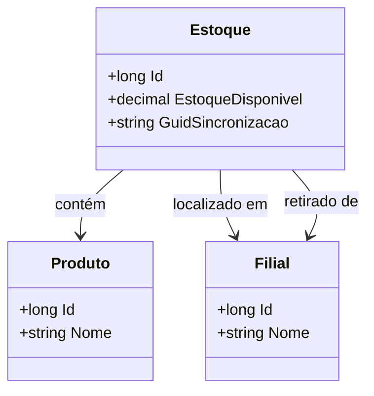

# Estoque
**Namespace**: IsthmusWinthor.Dominio.Entidades  
**Nome do Arquivo**: Estoque.cs  

## Visão Geral e Responsabilidade
A classe `Estoque` representa uma entidade do domínio responsável por gerenciar a quantidade de produtos disponíveis em uma ou mais filiais de um sistema de inventário. Sua principal responsabilidade é controlar a disponibilidade de produtos, permitindo operações que garantam que o estoque refletirá adequadamente as quantidades reais, facilitando a gestão de suprimentos e a operação em várias localizações.

## Métodos de Negócio
Neste momento, a classe `Estoque` não contém métodos com lógica de negócios complexa que necessitem documentação específica. Os métodos a serem focados devem ser implementados em um futuro próximo, com base nas regras de gestão de estoque.

## Propriedades Calculadas e de Validação
- **EstoqueDisponivel**: Esta propriedade deve ser acompanhada de regras de validação ao definir a lógica de negócios para evitar que valores negativos sejam registrados. Uma regra ideal seria garantir que, ao atualizá-la, o valor não se torne inferior a zero. 

## Navigations Property
- `[Produto](Produto.md)`
- `[Filial](Filial.md)`
- `[FilialRetira](Filial.md)`

## Tipos Auxiliares e Dependências
- Nenhum enumerador ou classe estática/auxiliar é utilizado diretamente na classe `Estoque`.

## Diagrama de Relacionamentos

